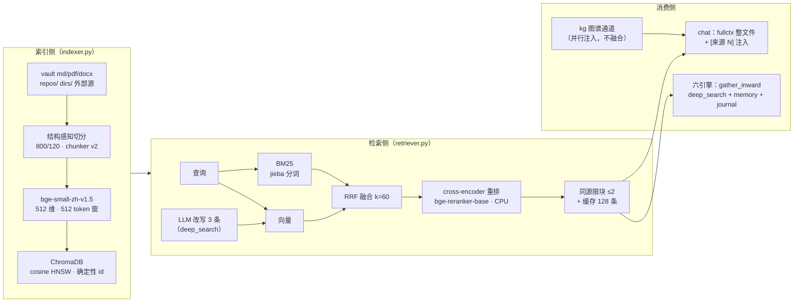
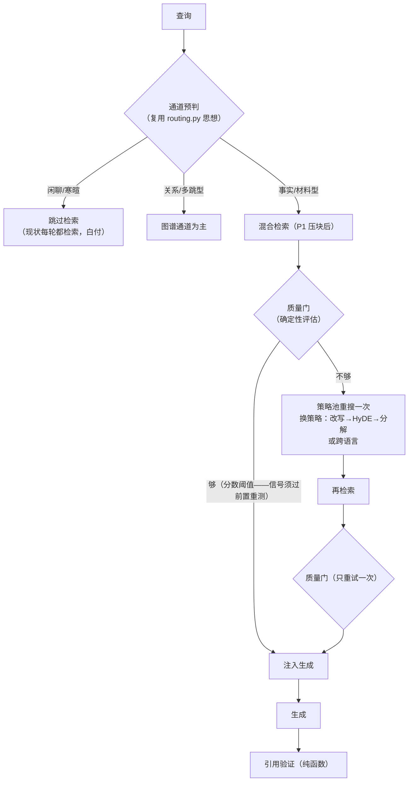

# RAG 升级方案

> 定位：RAG 专项升级（后续 Agent / 后端 / 前端另有专项）。以 2026-09 的业界格局为对标，
> 给出**量法先行、四期递进**的升级路线。所有"现状"论断均有代码出处；所有"业界"数据均标来源。
>
> 一句话结论：**这套 RAG 的工程骨架（混合检索+RRF+限块+缓存+版本契约）是 2026 年个人项目的第一梯队水平，但内核模型停在 2023 年**——且检索评测的尺子早已造好（app/core/evals.py 整套）却一次没喂过（eval_items=0）：P0 先喂尺子，P1 修截断保内核，P2 用 LangGraph 把检索 agentic 化，P3 接地闭环。
>
> **两个已拍板的决策（2026-09-19）**：① 嵌入模型**先用现在的**（bge-small-zh-v1.5 不换，换代挂账 §1.1；因此静默截断必须走"压块"修法，见 §0.3-1）；② **LangGraph 以 P2 的 CRAG 检索循环为试点**引入（选点依据见 §2 P2）；③（同日复核修订）对完代码修正三处失实论断：检索评测**已有整套 harness**（app/core/evals.py：Hit@k/MRR/faithfulness/回归对比/健康度诊断），只是金标集为空从未喂过；重排收益**量过一次**（smoke_rerank.py，a0ec0aa：hit@3 3→4、rerank 分数无窗口）；bge-small 参数笔误已改。P0 相应从"造尺子"改为"喂尺子"，P2 质量门加可分性重测前置——修订散见各节"复核"注。
>
> （2026-09-20 补记：①里「因此静默截断必须走压块修法」这半句已被实测推翻——压块净负，截断改由**窗口化 + max 池化**修掉，见 §3「P1a 修静默截断」；②的 LangGraph 试点尚未动工。）

---

## §0 现状盘点

### §0.1 现有链路

### §0.2 组件评级（架构师视角）

| 环节 | 现状 | 评级 | 依据 |
|---|---|---|---|
| 切分 | 结构感知（去噪/标题并块/碎块合并）+ chunker 版本戳 + 内容哈希漂移检测 | **B+** | 多数项目还是裸 splitter；版本契约是生产级设计 |
| 嵌入 | bge-small-zh-v1.5（2023 年，约 12 层 24M，512 维，**512 token 窗**） | **C-** | 2026 开源第一梯队已到 MTEB v2 68-75 分段（见 §1.1） |
| 词法 | jieba + BM25Okapi | B | 够用；与向量路互补的召回价值已被 RRF 利用 |
| 融合 | RRF k=60 + 同源限块 + epoch 缓存 | **A-** | 教科书级，`_diversify` 的回填设计比多数开源项目细 |
| 重排 | bge-reranker-base（278M）CPU | **C+** | 每次未缓存查询在付 ~1-2s CPU 延迟（20 对候选）；收益量过一次（smoke_rerank.py，a0ec0aa：小样本 hit@3 3→4，但 rerank 分数无窗口），P1b 在大金标上重测后拍去留 |
| 多查询 | LLM 改写（强制一条换语言）→ deep_search | **B+** | 有实测依据（"多带回 4-6 条原话撞不到的材料"） |
| 图谱 | Neo4j 实体/关系 + 实体向量，独立通道注入 | B | 与向量通道平行不融合，无"该走哪条通道"的判断 |
| 整文件注入 | fullctx：命中短文档整文件替换 chunk | **A** | 少见的正确设计（Open WebUI 同款思路） |
| 生成接地 | 提示词"尽量引用、标注 [来源 N]" | **C** | 无输出侧验证；chat 侧 RAG 质量零度量（引擎侧有接地分） |
| **检索评测** | evals.py 整套已在（Hit@k/MRR/faithfulness/run 记检索配置/回归对比/健康度诊断），但 **eval_items=0、eval_runs=0**——造好了没喂过；smoke_retrieval.py（广度/改写/缓存）、smoke_rerank.py（重排 A/B/C+可分性）两个散件也在 | **C-** | 器在、数据零：改坏了检索不会有任何一条历史曲线知道 |

### §0.3 两个现状缺陷（升级的硬理由）

1. **静默截断（bug 级）**：`CHUNK_SIZE=800` 字符 + 碎块合并上界 920 字符（`indexer.CHUNK_SOFT_MAX`），而 bge-small-zh-v1.5 的输入窗口只有 512 token——**实测**（`smoke_retrieval.py` 的块 token 分布）token/字符 = **0.53**（中英混排；本节原先按"中文约 1.3 token/字"估，偏高了一倍多），于是 964 个块里 **73 个（7.6%）超窗**，最多的块 749 token、尾部约 237 token 从没进过向量。sentence-transformers 超窗不报错、只截断。词法路（BM25）不受影响，所以平时看不出来。**已拍板不换模型 → 原定修法是压块：CHUNK_SIZE 降到 500 字符档（以 tokenizer 实测长度为准，见 P1a），`CHUNKER_VERSION` +1 走既有重建通道（此路已被实测否掉，见下条复核）。** 换大窗口模型（8K/32K）是挂账的更优解，何时重开见 §1.1。
   > **复核修订（2026-09-20）**：压块已按此实现并逐档实测，**结论是不上**——recall 对块大小单调，压块调优救不回来（数据见 §3「P1a 修静默截断」）。截断改由**窗口化 + max 池化**修掉：块的文本一个字不动，只把超窗块切成窗口分别编码、再逐维取最大，尾部从此进向量（同节第四、五条）。本节「必须走压块修法」这个前提已被实测推翻。
2. **重排在付盲钱**：`hybrid_search` 里 rerank 候选最多 top_k×4=20 对，bge-reranker-base CPU 上 20 对约 1-2 秒——每次未命中缓存的检索都在付。收益量过一次（smoke_rerank.py，git a0ec0aa）：6 相关 + 12 无关的小样本上，hybrid+rerank 把 hit@3 从 3 提到 4；但 **rerank 分数可分性为零**（相关/无关的 top1 分无窗口，当时因此保住了提示词底线）。旧数据留下两个待办——样本太小、延迟没量：P0 已在大金标上重测（结论见 §3 基线记录：排序净负、延迟 ~15s/query）。业界实测（Qwen 官方评测表）：bge-reranker-v2-m3 重排后 MTEB-R 57.03，**低于 Qwen3-Embedding-0.6B 不加重的 61.82**——重排不是免费午餐，换好嵌入后它可能整体下岗。

---

## §1 差距分析（对标 2026 业界）

### §1.1 嵌入模型：开源第一梯队已换代两轮

2026-05 MTEB v2 开源榜（presenc.ai《Best Open-Weight Embedding Models 2026》）：

| 模型 | 参数 | MTEB v2 | 窗口 | 许可 | 本地可行性 |
|---|---|---|---|---|---|
| Qwen3-Embedding-8B | 8B | ~75.1 | 32K | 通义自定义 | 需 GPU，排除 |
| **Qwen3-Embedding-0.6B** | 0.6B | ~67.8 | **32K** | 通义自定义 | **639MB，CPU 可跑** |
| **BGE-M3** | 0.6B | ~68.2 | 8K | **MIT** | 1.2GB，CPU 可跑，生产部署量第一 |
| bge-small-zh-v1.5（现状） | ~30M | 榜外 | 512 | MIT | CPU 快 |

差距量级：0.6B 级模型对 2023 年 small 档是**代差**，且窗口从 512 token 到 8K/32K——既修掉 §0.3-1 的截断，又给"更大块、更完整语义单元"的分块策略留了空间。

**决策（2026-09-19 拍板）：本版不换。** 候选（Qwen3-Embedding-0.6B vs BGE-M3）**挂账**，重开的触发条件写死，满足其一即重新评估：① P0 尺子建好后 recall@5 明显低于预期且压块调优救不回来；② 知识库规模增长到万 chunk 级、压块带来的块数膨胀开始伤检索质量；③ 出现"必须整段长文语义"的真实需求（如长报告按节检索）。届时 `stale_embed` 版本契约仍是最短升级通道（见 P1a 第三条）。不追 4B/8B——个人库 CPU 预算换不回那点分差。

> **条件 ① 的复核（2026-09-20）**：压块确实「救不回来」（recall 对块大小单调，数据见 §3「P1a 修静默截断」），但**换模型不再是修截断的必要条件**——窗口化 + max 池化已经把这个缺陷修掉（块文本不动、只改嵌入方式，实测配对净正、paraphrase hit@3 0.50→0.64）。所以本节挂账**不因截断而到期**：换模型的收益面窄了一块，重开它的理由回到 ②③（万 chunk 规模、整段长文语义）与「paraphrase 仍是最弱一档」；反过来说，将来真要换，`stale_embed` 这条路比现在更好走——戳里已经带上了方法版本，换模型与换做法分得开。

> **三个条件的最新读数（2026-09-24，全部免费）**：① **已关**（窗口化修掉了截断，见上一条）；
> ② **离得很远**：`indexer.stats()` = **964 块 / 95 文件**，是「万 chunk」门槛的 **9.6%**，
> 且 `stale` / `stale_embed` 都是 0（今天没有任何换代压力）；③ **没有**——今天唯一"整段进上下文"
> 的地方是 `fullctx`（**短**源文件整份进注入），而新落的引擎侧尺子（`smoke_gather_eval.py`）
> 量的是**跨文件凑齐**，不是"一份长文按节检索"。**结论：继续挂账，一个条件都没到。**
> 顺带记一条与质量门同族的理由：换模型今天能指望的只剩「paraphrase 仍是最弱一档」这一条，
> 而 paraphrase 正是**门口径分不开的那一桶**（63 条里 `bad` 的 5/10 条是它）——不是不能试，
> 而是"换模型"与"改判据"今天分不开量。**真要给它定价**（先量买多少、不换）最短路径是：
> 下载候选模型 → **只建一个临时索引** → 在现有 63 条金标上重跑检索尺子与 `smoke_quality_gate.py`
> （全程不调 API、不碰真索引，`stale_embed` 契约不受影响）。**代价是一次约 1.2GB 的模型下载**，
> 所以它是一件要拍板的事，不是顺手做的。

### §1.2 重排：CPU 机器上是奢侈品

业界 CPU 延迟实测（specpicks 2026）：bge-reranker-v2-m3（568M）CPU top-50 需 5–10 秒，**比生成器首 token 还慢**；Qwen3-Reranker-0.6B（BEIR 71.4）与 v2-m3（71.5）同级但同样贵。结论：**无 GPU 环境下重排层"是否保留、候选给多少"必须是量出来的决策**（现状 `rerank_enabled` 默认 True；smoke_rerank.py 量过一次，排序收益为正但只有 18 条样本——去留等 P0 大金标的数据，不是默认开的开关）。

### §1.3 查询理解：有改写，缺分解

现状 `rewrite_queries` 是"换说法"（同层扩展）。业界已验证的另外两档没有：**HyDE**（让模型先写一段假设答案，拿假设文档去检索——问题与文档的词汇鸿沟在"答案形态"上比"问题形态"小得多）和**子问题分解**（多跳问题拆单跳）。这两档与现有改写是并列策略，不是替代。

### §1.4 检索是一次性的：没有"检索质量"的判断

现状：`use_rag` 开 → 检索一次 → 注入 → 生成。检索结果好不好、够不够，没有任何判断——差结果直接喂给模型。业界 2024-2026 的主线路线是 **Corrective RAG**（检索 → 轻量质量评估 → 不足则改写/换路重搜，**只重试一次**）与 Self-RAG（按需检索+自我反思）。这是从"RAG pipeline"到"**Agentic RAG**"的分界线，也是本项目面试叙事（Agentic RAG）最该补的那块真材实料。

### §1.5 图谱与向量：平行注入，不做融合也不做选择

`chat.py` 里 kg_block 与 RAG context 是两条独立 system 消息，每次都各自注入。多跳/关系型问题图谱更强、事实型问题向量更强——现在不区分。融合（统一排序）工程重、收益不明；**通道选择**（按问题形态选主通道）工程轻、可复用 W 系列确定性路由的先例。

### §1.6 生成接地：提示词尽力，验证为零

`_build_rag_context` 说"尽量引用"，但没人验证生成里的 `[来源 N]` 是否真实存在于注入列表（模型可编一个 [来源 7]）。引擎侧有接地分，chat 侧零度量。且"这一轮注入了 5 条、模型实际引用了几条"——这个信号（sources 使用率）是检索质量最便宜的线上反馈，现在不落账。

> **已补（2026-09-20，P3，见 §3「P3 实施记录」）**：引用验证落在 `app/core/citations.py`（纯函数，线上与离线共用一份），**编造的编号从正文里剥掉并记账、不重生成**；`sources_injected` / `sources_cited` 开了正式列（`Migration(15)`）并上墙（`SourceUsageCard`「材料使用率」，四个计数、无比率）。**一条边界如实记**：编号在范围内但指错了材料（`[来源 2]` 说的其实是来源 4 的内容）这一层看不出来——那是语义问题，确定性判据不碰。

---

## §2 升级路线（四期，P0 是其余三期的前提）

### P0 · 评测基线：把已经造好的尺子喂饱（先做，0.5-1 天）

> **复核更正（2026-09-19）**：原案"新建金标评测器"与现状冲突——`app/core/evals.py` + `EvalItem`/`EvalRun` 表 + `routers/evals.py` 已是一整套（Hit@1/3/k、MRR、faithfulness 判分、**每次 run 自动记录检索配置**、`compare_history` 回归对比、`eval_health` 健康度诊断），只是金标集为空从未跑过；`smoke_retrieval.py`（广度/改写/缓存）与 `smoke_rerank.py`（重排 A/B/C + 分数可分性）两个散件也已在。P0 改为**喂已有 harness + 收拢散件**，不新建、也不覆盖任何同名文件。

**做什么**：
- 金标 30-50 条，source of truth 是 `backend/evals/retrieval/golden.jsonl`（`{query, expected_source, tag}`，**进 git、可审、可回滚**，对齐 `evals/skills/*.json` 先例）；配一个导入脚本灌进 `EvalItem`——jsonl 管版本、DB 管运行，两个角色不混；
- **出题三条硬纪律**（缺一条尺子就是歪的）：① 词汇重叠型（BM25 单独就能中）照常出；② **词汇鸿沟型（同义改写、词面撞不上）必须占三成以上**——§0.3-1 的截断伤的恰是向量路，金标全是词面匹配的话，压块的收益和害处都量不出来；③ 竞争型（多文件都可能相关）若干——`eval_health` 里"全满分假象"的警告就是为此写的。tag 记类型，分类型出分；
- 基线一条命令：给 `run_eval` 加 CLI 入口（smoke 包装，对齐 `smoke_cross.py` 形状），输出 hit@1/@3/@5、MRR、延迟，**外加索引指纹（chunker 版本、块数、embed 模型名）**——不记指纹，压块前后和历史曲线没法归因；
- 顺带把 `smoke_rerank.py` 的三模式对比在金标上重跑（旧结论只有 18 条样本）：重排 on/off 的差值与延迟当场见分晓。

**纪律**：只进脚本与曲线，不进零柒嘴里（红线总表 #2）；金标集不许被任何检索策略读进来当运行时数据（红线 #3"金标不进规则"——routing.PROTOTYPES 同款）。
**验收**：一条命令出全部指标 + 索引指纹；现状基线数字写进本文档 §3 表格；金标三类占比入档。

### P1 · 检索内核保健康（3-5 天，P0 之后，不换模型）

**P1a 压块修截断（主菜，不换模型版）**：
- `CHUNK_SIZE` 800 → **500 字符**、`CHUNK_OVERLAP` 120 → 80、`CHUNK_SOFT_MAX` 相应调到 580，`CHUNKER_VERSION` 2 → 3——数字不是拍的：先用**底层 HF tokenizer**（`embedder._get_model().tokenizer`；`SentenceTransformer.tokenize()` 已废弃且返回无意义值，别用）实测当前库全部块的 token 长度分布，取"99 分位 ≤ 500 token"的那个字符数，写进 `smoke_retrieval.py` 的输出里（阈值是量出来的纪律）；
- **副作用如实写**：块数预计 +60% 左右（更碎）、索引变大、检索粒度变细。**还有一笔最容易漏的账：注入总量会缩**——PER_SOURCE_MAX=2、top_k=5 不动的话，每次查询注入的内容约缩四成，fullctx 的 4000 字预算救得了短文档、救不了长文档。所以压块前后除了 recall 还要记"注入总字符数"的中位数，掉了就调 top_k 或 per-source 上限（数字用 P0 尺子量，不拍脑袋）。recall 若反而掉了（碎块丢了上下文），往回调 CHUNK_SIZE 再量，直到窗口内块占比、recall、注入量三项达标；
- **换代挂账通道保留**（将来重开 §1.1 时仍是零代码路径）：`embedder.MODEL_NAME` 换名 → 块元数据 `embed` 戳自动不一致 → `stats().stale_embed` 报告非零 → `reindex_all()` 重建——这套版本契约本来就是为换模型设计的（`indexer.py` 注释原话："换了模型，旧向量和新向量在同一个余弦空间里没有可比性，必须能被发现"）。届时 CHUNK_SIZE 可回升到 1200+ 换更完整的语义单元；
- 回退：`CHUNKER_VERSION` 与 CHUNK_SIZE 改回 + 重建即回滚，全程可逆。

> **实测结论（2026-09-20，见 §3「P1a 修静默截断」）**：本节按上述数字实现并逐档实测后**否掉了压块**。recall 对 CHUNK_SIZE 单调——越碎越差，到 800 都还在涨；而「p99 ≤ 512 token」要求 ≤600，「注入量掉了就调 top_k」也只能补回 hit@3、买不回 rank-1。**没有任何取值能同时满足窗口与 recall**，故按「量完不上」的规矩不切小块。截断改由**窗口化 + max 池化**修掉（块的文本不动，只改向量路），实测配对净正、且是唯一抬动 paraphrase 短板的改动。本节下面几条的前提因此部分失效：`CHUNK_SIZE` 维持 800、`CHUNKER_VERSION` 维持 2（切法没变），变的是嵌入方法、由 `embed` 戳的「模型#方法版本」记着。
>
> **本节的验收口径同日按人拍改写了**（原文「p99 ≤ 512 / CHUNKER v3 / P0 指标 ≥ 基线」三条按字面都没达成）→ 见 §3「P1a」第八条：改成「无内容被静默丢出向量 + 配对净正 + 指标不低回 P0 基线」，三条都能复跑。**要重开压块，先拿出「哪一档既满足窗口又不掉 recall」的数据。**

**P1b 重排降本（可能下岗）**：
- 用 P0 的重排 on/off 数据拍去留，判据用**配对比较**而非总分差：30-50 条金标上 1 条就是 2-3 个 recall 点，"差值 <2 分"整个落在噪声里；改为同查询 on/off 各跑一遍、数 per-query 胜负（升/平/降），只有"明显多数持平或更差"才**关掉 rerank**（实测这一关省的是 ~15s/题，见 §3 基线）——配对法把结论门槛从"总分精度"降到"胜负计数"，n 小得多也站得住。若保留，候选从 20 压到 12，并量 Qwen3-Reranker-0.6B 是否值回票价。**P0 基线（§3）已把判决提前给出：重排排序净负（on 赢 5 / 平 22 / off 赢 7）且实测 ~15s/query——保持关闭，本节只需归档这个结论**；
- `rerank_enabled` 默认值改为"由基线数据决定"，把决策写死在文档里，不做运行时自适应（确定性优先，红线 #10）。

> **实施记录（2026-09-20，见 §3「P1b 重排去留」）**：判决在 P1a 换过嵌入方式之后**重测并保持不变**（on 赢 5 / 平 23 / off 赢 6，on 档 563s vs off 1.1s，且 on 档把 paraphrase hit@3 从 0.64 打回 0.50）。默认值已按数据改成**关**，并收进唯一读取口 `prefs.rerank_enabled()`（原先四处各抄一份 `.get(..., True)`）。**「候选压到 12」不做**（那条只在保留时才成立）；重排代码留给将来上了 GPU 或想量 v2-m3 时重开。注意：重排只在 hybrid 路径生效，线上 `hybrid_search=false` 时它走不到——判决真正生效要等那笔免费午餐。

**P1c 查询理解加两档（并列策略）**：
- `deep_search` 的策略池从"改写"扩为三选一/组合：改写（现状）、**HyDE**（一次便宜模型调用生成假设段落，段入向量检索、原话入 BM25——两路各用最合适的形态）、**子问题分解**（复合问题拆 2-3 个单跳，走现有 `search_multi` 合并，管线零新件）；
- 策略选择第一版做**确定性规则**：问句含"为什么/怎么影响/区别"→ 分解；陈述型查询 → HyDE；其余 → 改写。不用模型选策略（省一次调用，且选择本身可测）；
- 每档单独跑 P0 尺子，**量出来的才上**（P2-2 向量阈值"量完判不上"的先例摆在那——量完说不上就不上）。

> **实施记录（2026-09-20，见 §3「P1c 查询策略池」）**：三档全部实现（含让 HyDE 成立的那层「两路可用不同查询形态」），并在金标上**各跑三遍**。判决与本节预期相反：**三档都没有稳定过线**，`decompose` 那点优势是噪声（三遍 0.6765 / 0.5294 / 0.6471），所以**一档都没上线**、默认仍是改写（不抢跑）。本节第 2 条那条确定性规则**实测不成立**——它把 34 条里的 24 条发给 `rewrite`，而 `rewrite` 恰是最差的一档。另量出一件更难看的：现役默认 `rewrite` 三遍都比单次检索差（配对 3/13、2/10、2/10）——**但金标量的是「找一条准的」，引擎要的是「攒一把全的」，所以没有据此改引擎路径**，那需要另补一把引擎侧的尺子。

### P2 · Agentic RAG：检索从一次变成一个受控小循环（4-6 天）

**目标形态**（对齐 CRAG，刻意轻量）：

> **前置·旧数据的警告（2026-09-19 复核）**：质量门最自然的信号"top1 rerank 分 ≥ 阈值"已经被 `smoke_rerank.py` 测死过一次（a0ec0aa：相关/无关 top1 分无窗口，当时因此保住提示词底线）。P2 动工前必须先在 P0 金标的相关/竞争/无关三档上重测可分性：重测仍无窗口，门就只能建在别的信号上（top1-top3 分差、命中 channels 数），或接受"确定性门不可分"并砍掉重试路径——无论哪个结论都入档。
>
> **重测结果（2026-09-20，见 §3「P2 前置 · 质量门可分性」）**：① 那个 rerank 分**线上已经不存在了**（P1b 把重排关了），所以重测的是还活着的信号；② **本节点名的两个备用信号都没窗口**（`top1−top3 分差` 实测方向是反的 AUC 0.154、`命中通道数` AUC 0.500）；③ 真正可用的信号是本节点**没点名**的 `vec_top1`（向量路原始相似度，门口径 AUC **0.814**）与 `both_frac`（**0.787**）；④ 光有 4 条负样本验不了门，已按人定的方案补到 10 条（44 条金标），阈值表落在 `vec_top1 ≥ 0.6241`：**误放率 14%，但好检索的放行率只有 67%**——这个运行点值不值得建，是 P2 的第一个真决定。

**三个刻意克制**（写死，防 Agentic 滑坡）：
1. **只重试一次**。重试不是自由度，是预算——CRAG 论文的核心也是单次纠偏，循环检索在个人库里只有成本没有收益；
2. **质量门是确定性函数**，不是模型判断：候选分数分布（top1 分数、top1-top3 分差、命中 channels 数）+ P0 量出来的阈值。**绝不让模型判断"检索得好不好"**（它判断不了，还慢）；
3. **通道预判复用 W 系列三级路由的形状**（规则→向量原型→不接模型），不新造意图体系（routing.py 的"不做"原话："不做意图体系、不做多轮槽位填充"）。

**LangGraph 试点定案（2026-09-19 拍板）：本节直接用 LangGraph 实现，不先做自研版。** 项目现状无 LangGraph（编排自研在 `tasks.py`），试点选点扫过四个候选，依据如下：

| 候选 | 形状 | 判定 |
|---|---|---|
| **P2 CRAG 检索循环** | 未实现（零迁移风险）、有真条件分支（质量门）、4-5 个节点、质量门纯函数可独立验证 | **✅ 试点落点** |
| chat 工具循环（`llm.run_agentic_chat`） | 有循环有分支，但被 chat / pet / tasks **三处消费**，W5 账本挂在上面 | ❌ 核心路径，试点失败半径太大 |
| `research.py` | 注释原话："显式四步管线，**不是自由 agentic loop**：可控、可离线测" | ❌ 它自己声明不要循环 |
| tasks 的 gate 卡点 | 形状像 LangGraph interrupt（human-in-the-loop），但动无人值守调度 | ❌ 挂账，等 CRAG 试点出结论再议 |

**试点形态**：用 `StateGraph` 表达上图——state 是 TypedDict（`{query, sources, quality, retries, strategy}`），节点是普通函数（检索 / 质量门 / 策略重搜），条件边 `add_conditional_edges` 承接质量门路由，`retries` 字段写死重试预算。**三条试点纪律**：

1. **质量门仍是纯函数**，图节点只调用它、不做判断——确定性签名（红线 #10）在图里原样成立，离线单测照跑；
2. **依赖最小**：只加 `langgraph` 一个包（纯 Python 编排库，无模型、无重运行时，本地优先兼容），**版本锁死在试点验证过的那个 minor**（它演进快，不锁的话半年后复跑不了）；不引入 checkpointer 持久化（试点不需要中断恢复），不上 LangChain 全家桶的其他件；
3. **退路写死在一开始**：质量门与策略池是纯函数、与图解耦（图只管编排）——万一要退，编排层换回自研 if/重试，纯函数一行不动。

试点成功（P2 验收过 + 延迟无明显回归）之后的第二候选才是 tasks 的 gate→interrupt 改造；试点失败则 LangGraph 撤出运行时，沉淀下来的结论是"对这个规模的编排，自研确定性循环优于图框架"——这本身也是面试可讲的判断。

> **实施记录（2026-09-20，见 §3「P2 实施记录」）**：纯函数层（`retrieval_gate.py`）与图（`crag.py`）都按本节的三条纪律落地了。**质量门纯函数 100% 单测覆盖**达成（42/42，用标准库 `trace` 数的）；**重试 ≤1 次**达成；**闲聊零检索未做**。但**消融是净负的**：门开 vs 门关 hit@1 0.5882 vs 0.6176、MRR 0.7034 vs 0.7206，延迟 **2.9s → 410.0s**；只看门真响了的 15 条正样本是「变好 3 / 持平 7 / 变差 5」。原因与 P1c 对得上——**纠偏的动作就是「换一档策略再搜一遍」，而 P1c 已量过三档都没超过单次检索**，地基不成立。另：本节的依赖判断「只加 langgraph 一个包、无重运行时」**与事实不符**（实际 5 个包，还把 `websockets` 降级）。
>
> **人拍定后的执行结果（2026-09-20）**：① **LangGraph 按本节自己写的退路判据撤出运行时**——`crag.py` / `test_crag.py` / `smoke_crag.py` 已删，`uv remove langgraph`，依赖树完全还原（相对 HEAD 零改动）；② **质量门留下但改了用途**——不触发重搜，改为在 chat 注入里**明说「材料里没有直接相关的」并要求不许硬答**（`chat.py` 的 `_build_rag_context`，门通过时一个字不加），结论记账进 `quality["rag"]`（零新表零迁移）。**纯函数层一行没动**——这正是本节纪律 3 留的退路。
>
> **通道预判已补上（2026-09-20，见 §3「P2 通道预判」）**：`app/core/channel.py`（三值 skip/kg/hybrid，照 W3 三级形状另写、**没动 `routing.py`**，判不定默认**去检索**）。金标 35 条上**误跳过 0**（红线）、准确率 35/35、**省下 12/35 轮检索**——**本节的『闲聊零检索』这条验收达成**。接线在 `chat.py`：skip 不检索、kg 先走图谱且图谱空则**回退混合检索**（线上 `kg_enabled=false`，该分支今天总走回退，如实记）。

### P3 · 接地闭环：检索质量进账本（2-3 天）

- **引用验证（纯函数）**：生成文本里的 `[来源 N]` 是否都在注入列表内、注入的 N 条被引用了几条——`turn_quality.py` 同款正则谓词形状，线上校验 + 离线可测，**同一份谓词两处用**（W2a 的先例原话："同一条规则在两个地方各写一遍，分叉的那天就没人敢信了"）；
- **失败行为写死：剥离伪引用 + 记账，不重生成**——编造的 [来源 7] 从文本里拿掉、turn_traces 记一笔即可；打回重写是一次多余的模型调用，还可能再编一次。验证器拦的是标注，不是回答本身；
- **sources 使用率进账本**：`turn_traces` 加 `sources_injected` / `sources_cited` 两个字段（W5 账本加字段，**零新表**）；连续多轮"注入 5 条引用 0 条"就是检索质量下滑的最早信号；
- **曲线进计量局**：使用率 + P0 的离线指标趋势挂上 PLAN5 R1 的那面墙（读数只挂墙不进嘴，红线 #2）。

---

## §3 验收与量法总表

| 期 | 交付 | 验收标准 | 量法 |
|---|---|---|---|
| P0 | 金标集（jsonl→EvalItem）+ run_eval CLI | 一条命令出 hit@1/@3/@5、MRR、延迟 + 索引指纹；金标含词汇鸿沟/竞争两类 | 现状基线入档 §0.3 两个缺陷均有数据 |
| P1a | 修静默截断（原「压块修截断」；判据已于 2026-09-20 按人拍改写） | **无内容被静默丢出向量** + 配对净正 + 指标不低回 P0 基线 | 块 token 分布 + 尾部探针余弦 + 同查询配对胜负（§3「P1a」五·八） |
| P1b | 重排去留 | 决策写死在文档，默认值与数据一致 | on/off 同查询配对胜负 + 延迟对比 |
| P1c | 查询策略池 | 每档策略独立跑分，上线的档 ≥ 基线 | 分策略指标表；量完不上也要留档 |
| P2 | CRAG 循环（LangGraph 试点） | 可分性重测先行入档；重试 ≤1 次；质量门纯函数 100% 单测覆盖；闲聊零检索；图节点不含任何判断逻辑 | 消融：门开/关的 recall 与延迟对比；试点结论（含失败结论）入档 |
| P3 | 接地闭环 | 伪引用被剥离且记账（不重生成）；使用率进账本 | 使用率曲线进计量局 |

> **P3 落地（2026-09-20）**：两条验收都达成——剥离与不重生成由 `tests/test_citation_wiring.py` 钉住（模型只调一次、落库正文里没有假编号），使用率进 `turn_traces` 正式列并上墙（`SourceUsageCard`，四个计数）。第三格「曲线」按人拍定**只给计数、不给比率**（理由见 §3「P3 实施记录」）。

### P0 基线记录（实测 2026-09-19，金标 n=34：lexical 13 / paraphrase 14 / competing 7）

索引指纹：chunker=2 · 958 块 / 92 文件 · stale=0 · bge-small-zh-v1.5（512 维）。评测检索-only（judge=False），零 LLM 成本。

| 档位 | hybrid | rerank | hit@1 | hit@3 | hit@5 | MRR | 检索延迟 |
|---|---|---|---|---|---|---|---|
| A 线上现行配置 | False | False | 0.4412 | 0.5882 | 0.7647 | 0.5461 | ~1.1s / 34 题 |
| B hybrid（无重排） | True | False | **0.6176** | **0.8235** | **0.8824** | **0.7191** | 1.0s / 34 题 |
| C hybrid + 重排 | True | True | 0.5882 | 0.7941 | 0.8824 | 0.7020 | **521s / 34 题 ≈ 15s/题** |

基线读出的三个判决：

1. **混合检索在生产里根本没开**——`config.json` 里 `hybrid_search=False`，§0.2 评为 A- 的 RRF 融合从没进过生产。B 对 A：hit@1 +17.6 分、hit@3 +23.6 分，延迟同量级（~30ms/题）。把开关拨回 True 是 P1 的第一笔免费午餐；
   > **已执行（2026-09-20）**：`data/config.json` 的 `hybrid_search` 拨回 **True**（走应用自己的 `save_config`，拨前后验过 DPAPI 密文明文一致；备份 `data/config.json.bak-20260920-141132`）。线上配置实测 **hit@1 0.6176 / hit@3 0.8235 / hit@5 0.8824 / MRR 0.7206**——与 B 档逐位一致，这笔午餐到账。`rerank_enabled` 保持 False（P1b 的判决）。
2. **重排不只是盲钱，是大钱**：20 对候选实测 ~15s/题，远超 1-2s 的通用估计；配对胜负 on 赢 5 / 平 22 / off 赢 7——按 P1b 判据（明显多数持平或更差 → 关），**重排保持关闭**，排序净负说明 bge-reranker-base 在这个语料上连排序质量都不贡献；
   > **P1b 复测（2026-09-20）**：换成 max 池化的新索引后重测，配对 on 赢 5 / 平 23 / off 赢 6、on 档 563.1s vs off 1.1s、paraphrase hit@3 0.64→0.50——判决不变，默认值已改成关。见 §3「P1b 重排去留」。
3. **paraphrase 类的短板就是截断咬的地方**：hit@3=0.57（B 档）远低于 lexical 的 1.00——§0.3-1 说的"向量只嵌了前半截"正是这个缺口。压块（P1a）或换模型能不能合上，拿这行数字对账。
   > **对账结果（2026-09-20，见下「P1a 修静默截断」）**：一半推翻、一半坐实。压块（切小块）把超窗从 7.6% 压到 0.1%，paraphrase hit@3 却纹丝不动（0.50→0.57，噪声内），反而 lexical hit@1 掉到 0.54——**「切小块能补 paraphrase」是错的**。但截断本身确实是这个缺口的一部分：把超窗块改用**窗口化 + max 池化**（块不切小）之后，paraphrase hit@3 从 0.50 抬到 **0.64**，是唯一动到它的改动。

复跑：`backend/.venv/Scripts/python.exe smoke_rag_eval.py`（A 档）/ 加 `--hybrid-on`（B）/ 再加 `--rerank-on --rerank-pair`（C 对照 B）。每次评测落一条 EvalRun，run 记录里带检索配置可回溯。

### P1a 修静默截断（实测 2026-09-20，结论：**块不切小，改走「窗口化 + max 池化」**）

**一、截断是真的，而且比方案估的轻**（`smoke_retrieval.py` 新增「块 token 分布」尺子；`SentenceTransformer.tokenize` 已废弃且返回无意义值，必须改用底层 HF tokenizer）：

| 参数 | 块数 | token p99 | token max | 超 512 窗的块 |
|---|---|---|---|---|
| 800/120（现状） | 964 | 628 | 749 | **73 块（7.6%）** |
| 600/100 | 1276 | 509 | 608 | 12 块（0.9%） |
| 550/90 | 1375 | 459 | 543 | 4 块（0.3%） |
| 500/80 | 1494 | **405** | 517 | **1 块（0.1%）** |

**token/字符 = 0.53**（中英混排实测）——§0.3-1 里「中文约 1.3 token/字」的换算偏高了一倍多，所以「600+ 字的块尾部从没进过向量」要改成：**7.6% 的块**被截，最长那块丢掉尾部约 237 token。512 是 BERT **绝对位置嵌入**的硬上限、不是配置项（[HF 讨论](https://discuss.huggingface.co/t/fine-tuning-bert-with-sequences-longer-than-512-tokens/12652)），所以「调大窗口」对这个模型是死的。

**二、语料漂移先隔离掉**：vault 自建索引后又增删过文件（新增 5 个、少 2 个），P0 的 958/92 与今天的 964/95 差的这 6 块就是它。两个变量拆开量过——**同一语料**下 800/120 复跑得 A 0.4412 / B 0.6471，与 §0.3 基线一致（差 ≤3 分，噪声级），所以下面的差都能记在改动头上。

**三、方案原定的压块修法：实现了、量完了、否掉了。** 按 §2 P1a 把 `CHUNK_SIZE` 800→500、`CHUNK_OVERLAP` 120→80、`CHUNK_SOFT_MAX`→580、`CHUNKER_VERSION` 2→3 重建（1494 块），逐档实测（同语料、同 34 条金标、rerank=off；B = hybrid on）：

| CHUNK_SIZE/OVERLAP | 块数 | A hit@1 | A hit@3 | A MRR | B hit@1 | B hit@3 | B MRR | B 注入中位数 |
|---|---|---|---|---|---|---|---|---|
| **800/120（现状）** | 964 | **0.4412** | 0.5882 | **0.5387** | **0.6471** | 0.7941 | **0.7314** | **2762** |
| 700/105 | 1105 | 0.4118 | 0.6176 | 0.5191 | 0.5882 | 0.8235 | 0.6985 | 2387 |
| 550/90 | 1375 | 0.3529 | 0.5588 | 0.4892 | 0.4706 | 0.7941 | 0.6186 | 2009 |
| 500/80 | 1494 | 0.3824 | 0.6176 | 0.4936 | 0.4706 | 0.7647 | 0.6137 | 1745 |

**recall 对 CHUNK_SIZE 单调：越碎越差，一路到 800 都还在涨**，没有甜点区。配对胜负也是净负（B 档 run#8→#10：改善 5 / 变差 10 / 持平 19）。而「p99 ≤ 512 token」要求 ≤600（600 实测 509，未单独跑金标——单调，必落在 700 的 0.5882 与 550 的 0.4706 之间）：**没有任何取值能同时满足窗口与 recall**。按方案「注入量掉了就调 top_k」补到 **top_k=8**，注入量 2915（超过基线）、hit@3 回到 0.8235，**但 hit@1 只到 0.5、MRR 0.652**——rank-1 的失守买不回来，多给几条只能补尾部命中。

**四、真正的修法是另一条路：块不动，只修向量路。** chunk-and-pool：超窗块按窗口切开分别编码，再把窗口向量合成一个；块的**文本一个字不动**，所以 BM25、注入量、切分契约全不受影响（判据借用「信号在哪」那条公开结论——信号落在 512 之后的块只有覆盖到才检索得到，[Towards Data Science](https://towardsdatascience.com/long-context-vs-short-context-model-when-does-a-long-context-model-win/)；[late chunking](https://arxiv.org/html/2409.04701v3) 要长上下文编码器，对 bge-small 不适用）。合成方式量了三种（都在 800/120、964 块）：

| 合成方式 | 块数 | A hit@1 | A hit@3 | A hit@5 | A MRR | B hit@1 | B hit@3 | B hit@5 | B MRR | B 注入中位数 |
|---|---|---|---|---|---|---|---|---|---|---|
| 不合成（原状：静默截断） | 964 | **0.4412** | 0.5882 | 0.7353 | 0.5387 | **0.6471** | 0.7941 | 0.8824 | **0.7314** | 2762 |
| 等权平均 | 964 | 0.3824 | 0.6471 | 0.6765 | 0.5108 | 0.5588 | 0.7647 | 0.8235 | 0.6701 | 2755 |
| 按 token 加权平均 | 964 | 0.4118 | 0.6176 | 0.7059 | 0.5289 | 0.5882 | 0.7941 | 0.8824 | 0.7005 | 2766 |
| **逐维取最大（max）** | 964 | 0.4118 | 0.6176 | **0.7647** | **0.5451** | 0.6176 | **0.8235** | 0.8824 | 0.7206 | 2549 |

- 等权平均**比什么都不做还差**：头窗口是块的主语所在，被平均掉一半（B hit@1 0.6471→0.5588）；
- 按 token 加权平均捡回一半（0.5882），仍低于不动；
- **逐维取最大是唯一净正的**：头窗口的强项一个都不丢，尾窗口只是往上加维度。平均会摊薄，取最大不会——这是它相对 mean 的全部理由。

**五、采纳 max 池化，三条理由都是量出来的**：
1. 截断**彻底消除**，机制直接验过：取最长块（749 token）第 512~592 token 的尾部当探针，它与该块向量的余弦从 **0.6961（截断）升到 0.7711（池化）**；池化向量与截断向量仍有 0.9636（同源、没跑偏）；**短块向量逐位不变（最大差 0.00e+00）**——所以全部差异只来自那 73 块。73 块 → 146 窗口，索引条目数不变。
2. 配对胜负（方案 §2 P1b 的判据）：**A 档赢 6 / 输 2 / 平 26，B 档赢 2 / 输 1 / 平 31**——净正，且绝大多数持平。
3. 它是**唯一动到 paraphrase 短板的改动**：B 档 paraphrase hit@3 **0.50→0.64**，而压块（0.57）和两种平均（0.43 / 0.50）都没动它。hit@3/@5 一起往上：A hit@5 0.7353→0.7647、A MRR 0.5387→0.5451、B hit@3 0.7941→0.8235。

**代价如实记**：hit@1 各少 1 题（A 0.4412→0.4118、B 0.6471→0.6176；n=34 下 1 题 = 2.9 分），B MRR 0.7314→0.7206，lexical hit@1 1.00→0.92（换来 paraphrase hit@3 +14 分），注入中位数 2762→2549（-8%，长块不再霸榜）。即「用一点 top-1 精度换尾部覆盖与 hit@3/@5」——**这个取舍是人拍的：量完之后决定保留**。

**六、版本契约跟着扩了一条**：`embed` 戳从「模型名」变成「模型名#方法版本」（`embedder.VECTOR_TAG` = `BAAI/bge-small-zh-v1.5#w1`）。模型没换、做法换了，旧向量和新向量同样没有可比性——只按模型名比对的话，这 73 块会假装自己是新向量。`stats().stale_embed` 与 `smoke_rag_eval.py` 的指纹都认这个戳，不为 0 就拒跑。**切分常量一个字没动**（`CHUNK_SIZE=800`、`CHUNKER_VERSION=2`），因为切法确实没变。

**七、§0.3-1 的一个隐含假设被推翻**：方案假定「截断伤的恰是向量路 → 压块该提 paraphrase」。实测压块把超窗从 7.6% 压到 0.1%，paraphrase hit@3 纹丝不动（0.50→0.57，噪声内），反而 lexical hit@1 从 1.00 掉到 0.54。**压块修不了 paraphrase**；真正把它抬起来的是 max 池化。

**八、验收状态（照实说，判据已于同日按人拍改写）**：§3 的 P1a 行原来按字面读——「块 token 长度 99 分位 ≤ 512」——**没达到**（块文本仍是 p99=628），因为那条判据默认了唯一的修法是切小块。它真正要保的东西是「**没有内容被静默丢出向量**」，这一点由池化满足、且有机制实测兜着（尾部探针 0.6961→0.7711；短块向量逐位不变）。

> **改写（2026-09-20，人拍定）**：旧判据（p99 ≤ 512 / CHUNKER v3 / P0 指标 ≥ 基线）三条按字面都没达成，但「指标 ≥ 基线」这条只在**单独摘出池化那一步**时不成立（hit@1 少 1 题、MRR −0.011，换来尾部覆盖与 hit@3/@5）；按 P1 收口的线上口径它是**大幅改善**（hit@1 0.4412→0.6176、hit@5 0.7647→0.8824、MRR 0.5461→0.7206）。所以判据正式改成三条：
> 1. **无内容被静默丢出向量**——机制由 `smoke_retrieval.py`（超窗块数 → 窗口数，尾部不丢）与 `tests/test_embedder_window.py`（短块原样进模型、长块覆盖到最后一个词）守着；那条**尾部探针余弦 0.6961→0.7711 是一次性探针**，数字留在 §3「P1a」五，要复跑得自己再写一遍（口径：最长块第 512~592 token 的尾部与该块向量的余弦）；
> 2. **配对净正**——同查询池化 on/off：A 档赢 6 / 输 2 / 平 26，B 档赢 2 / 输 1 / 平 31。**复跑要重建两档索引各跑一遍**（`smoke_rag_eval.py --hybrid-on`），逐条 rank 的配对在 EvalRun 明细里（run#22/24/26/28）；`--rerank-pair` 只自动配重排那一对，不配池化这一对。
> 3. **指标不低回 P0 基线**——按线上配置口径（hybrid on + rerank off + 池化）：hit@1 ≥ 0.4412、hit@5 ≥ 0.7647、MRR ≥ 0.5461（一条命令：`smoke_rag_eval.py --hybrid-on`，实测 0.6176 / 0.8824 / 0.7206）。
>
> **「压块」这一手段本身仍是否掉的**（recall 对 CHUNK_SIZE 单调，见上表），所以 `CHUNK_SIZE=800`、`CHUNKER_VERSION=2` 保持不变；要重开它得先拿出「哪一档既满足窗口又不掉 recall」的数据。

**九、这把尺子的已知偏差（如实记）**：金标判的是**文件级** hit@k——块越大越容易「沾到」期望文件，所以这把尺子结构上偏心大块；它能看见长块被摊薄的代价，看不见「单块噪声更少」这类好处。要判死得补块级标注或跑 judge=True 的端到端忠实度——那是 P0 尺子的下一步。

**十、补记：这个改动引入过一个真崩，已修（2026-09-20）**。`_windows` 调 tokenizer 走的是 `_encode_plus`（会设截断），而 `model.encode` 走 `_batch_encode_plus`（会设补齐）——**两种形态都在改写同一个 Rust tokenizer 对象**，交错时撞出 `RuntimeError: Already borrowed`。实测单独跑任一种都干净，混着跑（也就是 `embed_one`，每个查询都要走）3 线程就必现。而并发检索是这个应用的常态（评测器 `gather`、引擎并行取材）。修法：`embedder.embed` 里把「分词 + 编码」串在 `_encode_lock` 下。**修复后逐位复现 P1a 的全部数字**（0.6176 / 0.8235 / 0.8824 / 0.7206、注入 2549 全同），所以它是纯正确性修复、没改语义。代价是并发查询的编码段串行——个人库里可忽略。回归测试在 `tests/test_embedder_threadsafe.py`（本地有模型缓存才跑，CI 保持离线）。

**十一、这条漏在哪（值得记一笔）**：`run_eval` 的 `_one_case` 把检索异常写成 `out["error"]`、`rank` 留空——**失败会被算成 miss**。我回头查过全部 30 条 EvalRun：带错误的用例 **0** 条，所以本文 §3 里引用的基线/压块/池化数字没有被它污染。但这是运气好，不是设计：以后并发路径出的静默失败，会直接伪装成「检索变差了」。

**复跑**：`backend/.venv/Scripts/python.exe smoke_retrieval.py`（块 token 分布 + 向量法 + 窗口数）与 `smoke_rag_eval.py --hybrid-on`（B 档指标 + 注入总量）。三种合成的对比即上表四行（对应 EvalRun run#22/24/26/28）。换参数重测：改 `embedder._POOL_MODE`（max/mean）或 `indexer` 的三个常量后 `reindex_all()` + `repos.index_repo('hello-generic-agent')` 重建——**同语料、同金标**才可比。

### P1b 重排去留（实测 2026-09-20，结论：**保持关闭**，并把默认值改成关）

**判决在换过嵌入方式之后仍然成立**——这一点比数字本身重要：P0 那次是在「静默截断」的旧索引上量的，P1a 换成窗口化+max 池化后 7.6% 的向量已经变了。两次配对几乎一模一样：

| 量的时间 | 索引 | 配对（同查询 on/off） | rerank on 检索耗时 |
|---|---|---|---|
| P0（2026-09-19） | 958 块 · 截断 | on 赢 5 / 平 22 / off 赢 7 | 521s / 34 题 ≈ 15s/题 |
| **P1b（2026-09-20）** | 964 块 · max 池化 | on 赢 5 / **平 23** / off 赢 6 | **563.1s / 34 题 ≈ 16.6s/题** |

同一次运行里 on/off 两档的明细（run#29 / run#30）：

| 档位 | hit@1 | hit@3 | hit@5 | MRR | paraphrase hit@3 | 检索耗时 |
|---|---|---|---|---|---|---|
| rerank on | 0.5882 | 0.7941 | 0.8824 | 0.7020 | 0.50 | **563.1s** |
| **rerank off** | **0.6176** | **0.8235** | 0.8824 | **0.7206** | **0.64** | **1.1s** |

**它不是「没收益」，是负收益**：34 条里 23 条持平、赢 5 输 6，代价是**慢 512 倍**；更要命的是它把 P1a 刚挣来的 paraphrase 收益打回去了（hit@3 0.64→0.50）——bge-reranker-base 在这个中英混排语料上连「谁是更相关的那条」都判不准。按 P1b 判据（明显多数持平或更差 → 关）：**关**。

**「决策写死在文档 / 默认值与数据一致」这条验收的落点**：`prefs._DEFAULTS["rerank_enabled"] = False`，并把默认值收进**唯一读取口** `prefs.rerank_enabled()`。改之前 `.get("rerank_enabled", True)` 在四个地方各写了一遍（prefs + retriever + evals + smoke_rag_eval），默认值散在四处——抄反任意一处就是「默认开着、每查一次白付 16 秒」，而且这次它抄的正是**决策的反面**。读取口同时保证 smoke 的 `--rerank-on` 强制覆盖仍能穿透（配对复跑必需，已验）。

**「候选从 20 压到 12」不做**：那是「若保留」才有的动作；判决是关，归档即可。重排的代码与开关都留着——关的是默认值，不是能力；将来上了 GPU 或想量 Qwen3-Reranker-0.6B，配对量法原样可跑。

**与 hybrid 的耦合（必须交代）**：重排只在 hybrid 路径里生效。线上 `config.json` 现在是 `hybrid_search=false`，所以**当前配置下重排根本走不到**——P1b 的判决要等基线判定 1 的那笔免费午餐（`hybrid_search` 拨回 True）落地之后才会在线上真正生效。

**复跑**：`smoke_rag_eval.py --hybrid-on --rerank-on --rerank-pair`（配对 + 延迟，落 run#29/#30 同形状）。

### P1c 查询策略池（实测 2026-09-20，结论：**三档都没过「≥ 基线」，量完不上**）

**做了什么**：`deep_search` 的策略池从「只有改写」扩成三档并列（改写 / HyDE / 子问题分解），选档用 `pick_strategy` 的**确定性规则**（不让模型选——省一次调用，且「选择本身」可离线单测）。为了让 HyDE 成立，把 `_search_forms` 从 `hybrid_search` 里拆了出来：**向量路与词法路的查询形态可以不是同一句话**（假设段落进向量、原话进词法），`hybrid_search` 只是两路同形的那一次调用。`merge_hits` 把「同一条取最高分」收成一份，三档共用。

**量法**：`smoke_strategy.py`。每档**强制跑全部 34 条**（不是只跑规则挑中的子集——那样子集不同、n 不同，没法比），外加 `auto` 档（按规则分派，这才是「真上线会长什么样」）。生成结果按 (档, 查询) 记忆，`auto` 不重复花钱。

**这些生成是不确定的，所以量了三遍**（`temperature` 走 provider 默认，`none` 三遍逐位相同说明尺子本身稳）：

| 条件 | hit@1（三遍） | 均值 | Δ基线 | hit@5 均值 | MRR 均值 | 配对 赢/输（三遍） |
|---|---|---|---|---|---|---|
| `none` 单次检索（对照） | 0.6176 · 0.6176 · 0.6176 | 0.6176 | — | 0.8824 | 0.7206 | — |
| `rewrite`（现状默认） | 0.4706 · 0.5000 · 0.5588 | 0.5098 | **−10.8** | 0.8333 | 0.6368 | 3/13 · 2/10 · 2/10 |
| `hyde` | 0.5588 · 0.5882 · 0.5000 | 0.5490 | −6.9 | 0.8627 | 0.6658 | 7/9 · 6/9 · 6/10 |
| `decompose` | 0.6765 · 0.5294 · 0.6471 | 0.6177 | ±0.0 | **0.9216** | **0.7320** | 6/6 · 5/9 · 5/8 |
| `auto`（方案写的规则） | 0.5000 · 0.5588 · 0.5588 | 0.5392 | −7.8 | 0.8529 | 0.6650 | 5/12 · 3/7 · 4/10 |

**三条判决**：

1. **三档没有一个稳定过线。** `decompose` 第一遍看着最好（hit@1 0.6765、配对 6/6），第二遍掉到 0.5294、配对 5/9——**那 5.9 分是噪声**。它唯一稳定的收益是 hit@5（三遍 0.9412 / 0.8824 / 0.9412，都高于基线）与 MRR 略高，即「尾部更全、头名不稳」。按「量完不上」的先例（P2-2 向量阈值）：**不上**。
2. **`auto` 过不了，而问题在方案那条规则本身**：34 条里 24 条落在 `rewrite`，而 `rewrite` 恰好是最差的一档。「多跳→分解、陈述→HyDE、其余→改写」把大多数问题交给了最弱策略。要上线得先换规则，而换规则同样要过量（这一轮的结论是：本语料上**没有任何规则能凭空变好**）。
3. **顺带量出一件更难看的**：现役默认 `rewrite` 三遍都比单次检索差（配对 3/13、2/10、2/10，hit@1 均值 −10.8）。也就是说 `compose / conflict / decide / research` 四个引擎现在拿到的材料，**在这把尺子上**比不加策略还差。

**但第 3 条不能直接拿去改引擎**（这点必须写清，否则就是把尺子用错了地方）：金标是**找章节的事实型问答**——它要的是「一条准的」；而 `deep_search` 服务的是「攒材料写东西」的引擎——它要的是「一把全的」。这两个任务的最优检索不同，本尺子量不出后者。所以**未据此改动引擎路径的默认**；要动它，先补一把引擎侧的尺子（`evals/turns` 或引擎产物的人工判分）。

**已知的方法学缺口（如实记）**：`merge_hits` 按 `score` 跨查询取最高分，而 RRF 分数只在**同一次排序内**可比——跨查询比原始分严格说是不成立的（都在 1/61 这个量级附近，近似可用）。三档都抖得厉害，这可能是一个原因。要修得先给「跨查询归一化」一个定义，那是另一笔账。

**验收状态**：§3 的 P1c 行要求「每档策略独立跑分，上线的档 ≥ 基线；量完不上也要留档」——**跑分与留档完成，上线的档是「没有」**（默认仍是 `rewrite` 不变，不抢跑）。实现与开关都在 `retriever.py`，`deep_search(..., strategy=...)` 可随时复量；`tests/test_query_strategy.py` 14 条钉住「哪档被选中 / 段进哪一路 / 生成失败退到哪」。

> **2026-09-22 补：多了一条「委托臂」**（`Agent升级.md` §5 那句「A1 落地后查询策略统一走 delegate 通道」）。
> `retriever` 的三档生成各多一个 `via_delegate`（默认关），尺子那边多了
> `rewrite@delegate` / `hyde@delegate` / `decompose@delegate` 三档与 `--only`。
> **量到的：没有收益**——同一把 44 条金标上，`rewrite@delegate` vs 直连 `rewrite`：
> hit@1 **0.4091 vs 0.4545**（更差）、配对 **输 12 vs 输 8**（更差）、MRR 平（0.5322 vs 0.5386），
> 代价 **289s vs 114s（2.5×）**；唯一反过来的是 hit@3/hit@5（0.7045/0.7273 vs 0.6136/0.6818）
> ——那更贴引擎的需要，但**引擎侧那把尺子还没造**，不能拿这两个数替它（见下面那条欠账）。
> **（2026-09-23 补：那把尺子已经造了并跑过——`smoke_gather_eval.py` 10 题攒材料金标，
> 三档一样、整题凑齐率都是 60%、配对 p=1.0；所以这两栏仍然不足以翻案，见 §3 末那一小节。）**
> 委托内部账：44 次生成 66 轮、`kb_search` 32 次（**工具确实用上了**）、1/44 退回直连。
> 所以默认仍是直连；**要翻这个案，先补的是引擎侧尺子，不是在这把尺子上多跑几遍。**
> （同一轮还复现了 P1c 的主结论：`none` 0.4773 > `rewrite` 0.4545。）

**复跑**：`backend/.venv/Scripts/python.exe smoke_strategy.py`（默认 hybrid=on；`--hybrid-off` 换对照）。三档生成各 34 次调用，一轮约 4-6 分钟。

### P1 收口（2026-09-20）

| 项 | 结论 | 线上/代码状态 |
|---|---|---|
| P1a 修静默截断 | 压块否掉，改走**窗口化 + max 池化**（配对净正、paraphrase hit@3 +14 分） | 已上；`CHUNK_SIZE` 800 不变、`embed` 戳带方法版本 `#w1` |
| P1b 重排去留 | **保持关闭**（配对 5/23/6，慢 512 倍，还打掉 paraphrase 收益） | 已上；默认值改成关、收进唯一读取口 |
| P1c 查询策略池 | 三档实现并各跑三遍，**没有一档稳定过线** → 量完不上 | 实现留在 `retriever.py`，默认仍 `rewrite`（不抢跑） |
| §3 判定 1 免费午餐 | `hybrid_search` 拨回 **True** | 已上；线上实测 hit@1 0.6176、MRR 0.7206 |
| 附带 | 修掉一个 P1a 引入的并发崩（编码 `Already borrowed`） | 已上；回归测试 `test_embedder_threadsafe.py` |

**P1 的净效果**：线上（hybrid on + rerank off + 池化嵌入）**hit@1 0.4412→0.6176、hit@5 0.7647→0.8824、MRR 0.5461→0.7206**（对照 §3 P0 基线的 A 档），且超窗块的尾部不再静默丢失。

**没做/没上的**（留档）：压块、窗口化等权/加权平均池化、HyDE、子问题分解、方案那条 `auto` 规则。理由都在上面各自的小节里。

**一条留给 P2 的欠账**：金标量的是**文件级召回**（找一条准的），而 `deep_search` 服务的是引擎（攒一把全的）。P1c 量出现役 `rewrite` 在这把尺子上比单次检索差，但**没有据此改引擎路径**——那把尺子得另造。

### P2 前置 · 质量门可分性（实测 2026-09-20，结论：**门建得起来，但取舍要人拍**）

> 分两步：**第一步**用原有 34 条正样本量 → 发现「方案点名的信号全废、只有一个没点名的能用，而且 4 条负样本验不了门」；**第二步**按人来定的「先补负样本」补到 44 条 → 门量得动了，取舍也摆出来了（见本节下半）。

**为什么必须重测**：方案点名的「top1 rerank 分」在 P1b 之后**线上已经不存在**（重排关了）。所以只能用 hybrid 之后还活着的信号。量法 `smoke_quality_gate.py`（免费，只借本地 embedder；确定性，跑一遍即可）。标签口径：期望源出现在 top-k = 好（不用重试），不在 = 坏（该重试）。

| 信号 | hit@k 口径 AUC | hit@1 口径 AUC | 判定 |
|---|---|---|---|
| **`vec_top1`（向量路原始相似度）** | **0.792** | **0.751** | **有窗口** |
| `top1`（RRF 分） | 0.754 | 0.742 | 弱 |
| `gap13`（top1−top3 分差 —— 方案点名的备用信号） | 0.329 | 0.533 | **无窗口** |
| `top1_ch`（命中通道数 —— 方案点名的备用信号） | 0.500 | 0.500 | **无窗口** |
| `gap12` / `both_frac` / `n_hits` | 0.50–0.64 | 0.50–0.59 | 无窗口 |

**三条结论**：

1. **方案点名的那两个备用信号不行**：`top1−top3 分差` 在 hit@k 口径上 AUC **0.329**（比随机还反），`命中通道数` 恰好 0.500（所有 top1 都命中两个通道，这个信号没有方差）。所以「换信号」这条退路，按方案自己列的那两个，是走不通的。
2. **但有一个方案没点名的信号可用：`vec_top1`**（重排之前那一层的向量原始相似度），AUC 0.79 / 0.75。也就是说旧结论「相关/无关的 top1 分无窗口」（a0ec0aa）**不能搬到这个信号上**——那次量的是 rerank 分，不是向量相似度。
3. **然而第一版的尺子验不了门**：hit@k 口径下只有 **4 条坏样本，且全部落在 paraphrase**（lexical 13 好 / 0 坏、competing 7 好 / 0 坏、paraphrase 10 好 / 4 坏）。**4 个负样本既调不出阈值、也验不了阈值**。

### P2 前置（续）· 补负样本之后（2026-09-20，结论：**门建得起来，但取舍是真的**）

按「先补负样本」这条走完：金标从 34 条扩到 **44 条**（新增 `no_answer` 一类 10 条），并改了模式与校验——正样本**必须有**期望源、负样本**必须没有**（`load_golden` 两边当场卡死）；负样本**不灌进 `EvalItem`**（`run_eval` 量不了它们，灌进去只会让 `eval_health` 多一条「N 条没有期望源」的噪音）；配比纪律按**正样本**算。正样本的指标一位没变（0.6176 / 0.8235 / 0.8824 / 0.7206），确认负样本没进分母。

**负样本怎么来的（这部分是我出的题，请复核）**：不靠检索判断「答不上来」，而是**在语料里 grep 关键词确认为零命中**，再分两档——`明显域外` 6 条（k8s / Kafka / SwiftUI / tokio / goroutine / 红烧肉）与 `贴着语料但没写` 4 条（多租户隔离、离线 ASR 模型、镜像构建、HTTPS 证书）。第二档才是门真正要判的：检索会返回**主题相邻**的材料、分数还不低（比如「镜像构建」会撞到 FastAPI 剪藏里那个 Docker 标题）。两条配比纪律都写进了 `tests/test_golden.py`（各 ≥3 条）——只出容易的那一档，门学会「话题不像就不开」就够了，而那正是它没用的地方。

**门口径**（`good` vs `bad ∪ negative`——只分开 `bad` 没用，门还必须认出「库里根本没有」）：

| 信号 | AUC(门口径) | 读数 |
|---|---|---|
| **`vec_top1`**（向量路原始相似度） | **0.814** | 可用；good 中位 0.6374 / neg 中位 0.5755 |
| **`both_frac`**（top-k 里双通道占比） | **0.787** | 可用，且更好解释；good 中位 1.00 / neg 中位 0.40 |
| `top1`（RRF 分） | 0.733 | 偏弱 |
| `gap13`（top1−top3 分差） | **0.154** | **方向是反的**——方案猜它能当门信号，实测它对负样本反而更大（负样本里 0.0131 vs 好样本 0.0020）。**猜反了，这一条进档。** |
| `gap12` | 0.460 | 无窗口 |
| `top1_ch` / `n_hits` | 0.500 | 没有方差 |

**阈值表（`vec_top1`，用 AUC 最强的那个信号）**：

| 阈值 | 放行率(好) | 误放率(坏) |
|---|---|---|
| ≥ 0.5560 | 97% | 71% |
| ≥ 0.5838 | 83% | 57% |
| ≥ 0.6068 | 80% | 29% |
| **≥ 0.6241** | **67%** | **14%** |
| ≥ 0.6696 | 37% | 7% |

**取舍是真实的、也是这个门值不值得建的答案**：把误放率压到 14%，代价是**三分之一的「好」检索也会被门判成该重搜**。CRAG 只重试一次，所以这些是白付的调用，还可能把本来好好的结果换差。**要不要接受这个运行点，是 P2 的第一个真决定**——它决定「质量门 + 单次纠偏」到底上不上，而不是怎么上。

**这一步交出去的东西**：`smoke_quality_gate.py`（免费、确定性、可复跑）；10 条负样本（**待复核**，它们是我出的题）；正负样本的字段与配比纪律（`tests/test_golden.py` 7 条）。**已知的缺口**：`good` 那一组里 `bad` 仍然只有 4 条、全在 paraphrase，所以「门能不能认出**检索失败**」主要靠 10 条负样本撑着，而不是靠真实的失败正样本——补更多 paraphrase 竞争题仍然是欠账。

**复跑**：`backend/.venv/Scripts/python.exe smoke_quality_gate.py [--k 5]`。免费、确定。

### P2 实施记录（2026-09-20，结论：**门立得住、纠偏净负——半个 P2 该退**）

**做了什么**（按方案的三条试点纪律）：
1. **纯函数层** `app/core/retrieval_gate.py`：质量门 `assess`（`vec_top1 ≥ 0.6134 且 both_frac ≥ 0.6`）+ 重试预算 `should_retry` + 换档 `next_strategy`。**判据可搬**——量法与线上调的是同一个函数、同一份命中（第一版量法自己取向量通道 top1，与生产差 **0.0635**，阈值直接失效；这条已写进模块注释）。
2. **编排层** `app/core/crag.py`：LangGraph `StateGraph`，state 就是方案给的五个字段，节点只搬运、判断全在纯函数里（方案验收：「图节点不含任何判断逻辑」）。
3. **验收**：
   - 「质量门纯函数 **100% 单测覆盖**」→ **达成**，而且是机器数的：`smoke_gate_coverage.py`（标准库 `trace`，因为本环境没装 pytest-cov）报 **42/42 = 100.0%**；
   - 「重试 **≤1 次**」→ 达成（`tests/test_crag.py` 里有一条专测「预算花完就认了」）；
   - 「**闲聊零检索**」→ **未达成**，通道预判要接 chat 路径，本步没做。

**依赖账（方案那句「只加 langgraph 一个包」与事实不符）**：`uv add langgraph` 实际装进来 5 个包——`langgraph 1.2.11`、`langgraph-checkpoint 4.2.0`、`langgraph-prebuilt 1.1.0`、`langgraph-sdk 0.4.4`、`ormsgpack 1.12.2`，**并把 `websockets` 从 17.0.1 降到 16.1.1**（这是应用自己在用的运行时包）。全量套件 97 个文件仍全绿，所以降级没打坏东西，但「无重运行时」这个判断是错的——`langgraph-checkpoint`、`langgraph-sdk` 都不是纯编排件。已按方案把版本锁在 minor：`langgraph>=1.2.11,<1.3`（pyproject + uv.lock 同步）。

**消融（门开 vs 门关，金标 44 条）——这是决定 P2 纠偏上不上的那个数**：

| | hit@1 | hit@3 | hit@5 | MRR | 延迟（44 条合计） |
|---|---|---|---|---|---|
| **门关**（现状：单次检索） | **0.6176** | 0.8235 | **0.8824** | **0.7206** | **2.9s** |
| 门开（CRAG 单次纠偏） | 0.5882 | 0.8235 | 0.8529 | 0.7034 | **410.0s** |
| 差值 | −0.0294 | ±0 | −0.0294 | −0.0172 | **140×** |

- 配对（全部正样本）：门开赢 **3** / 平 26 / 输 **5**——净负；
- **只看门真的响了的那 15 条正样本**（重试的收益只有这群人看得见）：变好 3 / 持平 7 / **变差 5**——净负。它修不好的那几条（网页校验值、抓数据缺块、热榜评论）反而从 @1/@3 掉到 @2/miss；
- 负样本（库里没有答案）：门响了 **9/10**（门按设计工作），但这 9 次重搜**一定救不回来**，是纯成本；
- 延迟 2.9s → **410.0s**：24 次重搜 ≈ 17s/次，贵在便宜模型那一跳（健康检查里那个 provider 单次 8.3s）。

**为什么是这个结果（和 P1c 对得上）**：单次纠偏的动作就是「换一档策略再搜一遍」，而 P1c 已经量过——**三档策略在这份语料上都没超过单次检索**。地基不成立，上层自然也不成立。这不是实现 bug，是方案假设被两次独立测量否掉。

**判决（2026-09-20 已由人拍定并执行）**：
- **门本身立得住**（AUC 0.80、负样本 9/10 响、好检索误伤 7%）——**留下，但用途改为「材料不足」的明示**（不触发重搜）：`chat.py` 的 `_build_rag_context` 在门不通过时明说「这批片段里没有与当前问题直接相关的材料」，并要求**不许硬答、不许拿常识冒充材料**；门通过时**一个字都不加**（那段提示词是校准过的）。零额外调用、零延迟。**记账走 `quality["rag"]`**（`ok` / `vec_top1` / `both_frac` / `reason`）——挂在 W2a 的 `quality_json` 里落库，**零新表零迁移**；`turn_trace._write` 是逐字段映射列的，往 draft 里塞新键会被**静默丢掉**，所以没走那条路（P3 给检索质量开正式列时再搬）。测试：`tests/test_rag_context_gate.py` 4 条。
- **纠偏路径不上**（净负 + 140 倍延迟），**LangGraph 按方案自己的退路判据撤出运行时**：删 `app/core/crag.py`、`tests/test_crag.py`、`smoke_crag.py`；`uv remove langgraph` 卸掉 5 个包，`uv.lock` 取回提交态——**依赖树完全还原**（`websockets` 回 17.0.1、`langgraph` 不可导入、`pyproject.toml` 与 `uv.lock` 相对 HEAD **零改动**）。纯函数层 `retrieval_gate.py` **一行没动**（这正是纪律 3 留的退路）。
- **两条已知边界（如实记；后续状态见 §3「四期收口核对」）**：① **一条都没检索到时不做明示**——当时怕「闲聊 + 常开 RAG」每一轮都被灌一句「材料里没有」，而本该拦住它的「通道预判」（闲聊零检索）还没做 → **2026-09-20 已补齐**（通道预判落地后 skip 那一路根本不检索，零命中那一支于是可以安全地明说「没有检索到任何材料」）；② **引擎路径（`gather_inward` / `deep_search`）没接门**，只接了 chat —— **这是有意留的边界**（本节 §5 明写「引擎侧零感知、对外签名不变」），与通道预判无关，至今仍是如此。

**复跑**：`smoke_quality_gate.py`（可分性与规则扫描，免费确定）/ `smoke_gate_coverage.py`（纯函数层覆盖，42/42）/ `pytest tests/test_retrieval_gate.py tests/test_rag_context_gate.py`。**消融的复跑要重装 langgraph 并重写编排层**——编排层已按判决撤出仓库，数字留在本节。

### P2 通道预判（实测 2026-09-20，结论：**上了**——闲聊零检索达成）

方案 §3 的 P2 验收最后一条「**闲聊零检索**」（现状每轮都检索，白付一次嵌入 + 一次混合检索）。目标形态的第一格就是它：「通道预判（复用 routing.py 思想）」。

**做了什么**：`app/core/channel.py`，三值（`skip` / `kg` / `hybrid`），形状照 W3 的三级（规则 → 向量原型 → `classify_fn` 那条缝留着不接线）。**两处取舍跟 W3 相反，都写死在模块里**：

1. **判不定默认「去检索」，不是「闲聊」**。W3 那边默认按闲聊处理（「误判的代价是把闲聊变成产出」）；这里方向反了，因为代价不对称：**漏判**（该跳过却检索）= 白付几十毫秒本地嵌入 + BM25；**误判**（该检索却跳过）= 材料缺失、答案变差，**而且用户看不见**。
2. 按方案 §5「本方案不动 PLAN2/3/4 已落地的任何模块」，**没有改 `routing.py`**——照形状另写（只用它公开的 `find_kind`）。真要合成一层，得先动 §5 那条边界。

**尺子与结果**（`smoke_channel.py`，免费、确定；金标 `evals/routes/channel.json` 35 条 = 跳过 12 / 图谱 5 / 混合 18）：

| 指标 | 数 | 说明 |
|---|---|---|
| 准确率 | **35/35** | 但样本是我出的题，**请复核** |
| **误跳过**（该检索却判 skip） | **0** | **红线**——退出码 0 就是它守住了 |
| 漏跳过（该跳过却去检索） | 0 | 只白付一次检索，不算失败 |
| 分级 | 规则 31 / 向量 3 / 默认 1 | 规则级扛了绝大部分（诚实记：向量那一级只判掉 3 条） |
| **省下检索** | **12/35 轮** | 这就是「闲聊零检索」的收益 |

红线用例是**故意放的**：「你好，帮我看看这份材料里怎么说的」「早上好，那份周报里的数据对不对」「在吗？顺便问一下无幻觉上下文长度是什么概念」——看着像寒暄，其实要材料，一条都不许判 skip。

**一个中文子串的坑（写下来防再犯）**：`"有关系"` **不是** `"有什么关系"` 的子串（字符是 有,什,么,关,系，`有` 与 `关` 不相邻）。第一版只写了长的那条，「这两份事故有关系」漏；只写短的那条，「这两份材料有什么关系」漏。**两条都得在词表里**。这一条是被金标抓出来的（35 条里唯一那条 miss）。

**接线**：`chat.py` 的 RAG 段——`skip` 直接不检索（发 `rag_skipped` 事件）；`kg` 先走图谱，**图谱没给出东西就回退混合检索**（别让关系型问题空手而归，这也是 `kg` 判错不贵的原因：失败可见且自动降级）；`hybrid` 走原路。通道结论与门一起记进 `quality["channel"]`（同 `quality_json`，零新表）。线上 `kg_enabled=false`，所以今天 `kg` 分支总是走到回退——**决策实现了、效果等 KG 打开才出现**（如实记）。

**复跑**：`backend/.venv/Scripts/python.exe smoke_channel.py`（免费确定；**退出码 0 = 零误跳过**）/ `pytest tests/test_channel.py`（17 条）。

### P3 实施记录（2026-09-20，结论：**上了**——伪引用被剥离且记账，使用率进账本 + 上墙）

方案 §3 的 P3 验收两条：「**伪引用被剥离且记账（不重生成）**」与「**使用率曲线进计量局**」。量法：`smoke_citations.py`（免费、确定）+ `tests/test_citation_wiring.py`（走产品自己那条路）。

**做了什么**：

1. **纯函数层** `app/core/citations.py`：`verify(text, injected)` → `Report`（`injected` / `markers` / `cited` / `fake`，全是事实，没有分数）、`strip_fake(text, injected)` → （干净正文，拿掉了哪几个）。**判定只有这一处**，线上（`routers/chat.py`）与离线（`core/turn_eval.py`）共用——W2a 的先例原话：「同一条规则在两个地方各写一遍，分叉的那天就没人敢信了」。
2. **动作写死：剥离 + 记账，不重生成**（照方案）。剥完的正文**替换**屏幕上那份（回一帧 `citations` 带干净正文）：那几个编号已经随流到了屏幕上，不换掉就是「库里剥了、屏幕上还留着」——两边不一致比不剥更糟。`tests/test_citation_wiring.py` 钉住**模型只被调一次**。
3. **两个计数开正式列**（`Migration(15)`，`turn_traces.sources_injected` / `sources_cited`）。P2 当时把它们挂在 `quality_json` 里并写明「P3 给它开正式列时再搬」——搬的理由就是**它是给聚合用的**：挂在 JSON 里只能一行行读出来自己数。另加一条毛病 `quality["citations"]["stripped"]` → 回合清单里的「编了个不存在的来源」。
4. **上墙**（人拍定 D）：新卡 `SourceUsageCard`「材料使用率」，四个计数（注入过材料的回合 / 一共注入 / 被引用 / 一条都没引用的），**一个比率都没有**。与「回合读数」同一份载荷（`/api/dashboard/turns`），零新端点。

**尺子与结果**（`smoke_citations.py`，金标 `evals/citations/cases.json` 20 条 = 含编造 9 条 / 含真引用 8 条 / 两者都无 3 条）：

| 指标 | 数 | 说明 |
|---|---|---|
| **漏剥**（假编号没认出来） | **0** | **红线**——留着的是点开什么都没有的指针 |
| **误剥**（认成了引用 / 吃掉真引用） | **0** | **红线**——删掉的是真话 |
| 不该动的文本被吃掉 | **0** | `[来源 N]` / `[资料来源 3]` / `[来源 七]` / `[来源 1-2]` / `【来源 7】` 五种写法逐字保留 |
| 剥完之后还剩假编号 | **0** | 剥离真的逐条生效 |

**判据写窄是刻意的**：`CITE_RE = \[\s*来源\s*(\d{1,3})\s*\]`，一个字符都不放宽。上面那五种「像引用但不是」的写法一个都不动——**宽匹配吃掉的是真话，比漏一个假编号贵**。这五种各有一条用例。

**方向与 `channel.py` 一致（代价不对称）**：误剥一条真引用（内容还在、只是少个角标）比留一个假指针（用户信了、点不开）便宜。所以**「这一轮一条都没注入」时，正文里任何 `[来源 N]` 都按编造处理**——这一轮它手里根本没有编号表。

**四条已知边界，如实记**：

1. **跨轮引用会被一起剥掉**（真实代价）：这一轮没检索、正文却提「接着上面 [来源 3]」，那个编号会被拿掉。本轮检索不到上一轮的编号表，认了——写进模块开头。
2. **正文里引用的原文标记也按编造处理**：模型若在代码块里举例说明「提示词写的是 `[来源 12]`」，那也会被吃掉（用例 `c20` 就是这个，**用例里明写它是已知代价**）。要区分「在引用材料」与「在举例说明标记长什么样」得读语义，而这一层是确定性的。
3. **编号在范围内但指错了材料，这一层看不出来**（`[来源 2]` 说的其实是来源 4 的内容）——那是语义问题，确定性判据不碰。这一层拦的只是「点开什么都没有」，与 W2a 的 `invented_path` 同一类。
4. **引擎侧那个 `[n]` 角标格式（`markdown.tsx`）不在这一层**：它是四个引擎的成文卡片，本来就由引擎自己给来源表；这里只管 chat 这条路上的 `[来源 N]`。

**两条人拍定的事（2026-09-20）**：① 使用率**单开一张卡、只给计数不给比率**（备选是并在回合读数卡里 / 先不上墙 / 给比率——给比率要改 R1 那条 `no_rate` 口径，没选）；② 剥掉时不**在气泡上另外说一句**（说了就得把它落进 `messages`，否则刷一下提示就没了——那是另一种不一致；事实留在账本与那一栏毛病里）。

**接线**：`chat.py` 的 `run_one` 里一处 `verify_citations()`，在**任何判决之前**调用（`long_body_without_a_receipt` 数的是长度，剥完再判，两处口径才对得上），补跑那一轮再调一次（`stripped` 累计，第一遍剥掉的那几个不会被第二遍冲掉）。计数由 `_record_turn` 搬进正式列（**只读不重算**）。

**复跑**：`backend/.venv/Scripts/python.exe smoke_citations.py`（免费确定；**退出码 0 = 零漏剥 + 零误剥**）/ `pytest tests/test_citations.py tests/test_citation_wiring.py tests/test_turn_trace.py tests/test_migrations.py`。离线那一半在 `evals/turns/deliver_report.json` 的用例 ⑦（`no_fake_citation`，**真模型跑一次**，见 `docs/testing.md` §5）。

### 四期收口核对（2026-09-20，回答「计划里的任务都完成了吗」）

**结论：四期的交付与量法都落地了；两条悬置当日已由人拍定并收口，剩两笔欠账。**

| 期 | 验收原文（§3 表 / §2 小节） | 状态 |
|---|---|---|
| P0 | 一条命令出 hit@1/@3/@5、MRR、延迟 + 索引指纹；金标三类占比入档 | ✅ 达成（`smoke_rag_eval.py`；三类 13/14/7 入档） |
| P1a | ~~块 token p99 ≤ 512 · CHUNKER v3 · P0 指标 ≥ 基线~~ → **无内容被静默丢出向量 + 配对净正 + 指标不低回 P0 基线** | ✅ 三条都达成；**判据是 2026-09-20 按人拍改写的**（理由与三条新判据见 §3「P1a」八）——旧判据按字面三条都没达成，这一点没有藏 |
| P1b | 决策写死在文档、默认值与数据一致 | ✅ 达成（默认改成关 + 唯一读取口） |
| P1c | 每档独立跑分、上线的档 ≥ 基线；量完不上也要留档 | ✅ 跑分与留档；**上线的档 = 零个**（量出来的结论，不是没做） |
| P2 | 可分性重测入档 · 重试 ≤1 · 门纯函数 100% 覆盖 · 闲聊零检索 · 图节点不含判断 | ✅ 前四条达成；第五条随 LangGraph 撤出运行时**失效**（按方案自己写的退路撤的） |
| P3 | 伪引用剥离且记账（不重生成）· 使用率进账本 · 曲线进计量局 | ✅ 三条达成（曲线按人拍定只给计数） |

**边界①当日已补齐（2026-09-20）**：`chat.py` 的 RAG 段现在多了一文 —— 真的去检索了、却**一条都没返回**时，把门自己算出的那句「没有检索到任何材料」原样发给模型（`_build_rag_context([], quality=rag_gate)`），并要求**不许凭常识作答、要直说缺什么**；同时发一帧 `rag_empty` 留痕。**闲聊不会被误伤**：skip 那一路根本不检索（通道预判），走不到这一支——`tests/test_rag_context_gate.py` 用两条**走产品全路径**的用例把这两面都钉住了（零命中真的进了 messages / 闲聊的 system 里没有那句话）。

**还欠着的两笔（都不挡路，留着）**：

1. **金标里真实的失败正样本只有 4 条、全在 paraphrase**（§3「P2 前置（续）」末自己写下的缺口）——「门能不能认出**检索失败**」目前主要靠 10 条 `no_answer` 负样本撑着，补竞争/鸿沟类坏样本仍挂着。
   → **2026-09-23 已补（金标 44 → 63 条）**，补法是**量出来的**：写了 42 条候选题（三种形状：相近章节挑错、SOP 速查卡输给父章节、口语短问），**免费跑一遍检索**，命中的进 `good`、没命中的才是 `bad`，每条都用索引原文核过「期望源真是答案」。结果：**`bad` 4 → 10**（paraphrase 5 / competing 5）、`good` 30 → 39、`no_answer` 10 → 14。
   **重测的读数往差的方向走，这才是它该有的样子**：门口径 AUC `vec_top1` **0.800 → 0.696**、`both_frac` 0.787 → **0.712**（现在是更强的那个）；上线那个运行点在 63 条上实测是**放行 56% / 误放 21%**（旧 docstring 写的「放行 63% / 误放 7%」是 4 条失败正样本撑出来的）。原因写在 `retrieval_gate.py` 的 docstring 里：新样本是**「差一口气」的形状**（检索回来一个**相近**的东西），向量相似度照样高——**这个门分得开「答非所问」，分不开「找到了相近的一份」**。
   **阈值刻意没动**（`VEC_FLOOR`/`BOTH_FLOOR` 一个字节没改）：改运行点是产品决定；而且门的用途在 P2 落地时已经从「触发重搜」变成「在注入里加一句警告」，**代价不对称跟着变了**——今天更贵的是误报而不是误放。数据留档：误放 ≤5% → 放行 41%，≤10% → 49%，≤15% → 54%，≤20% → 56%。
   → **2026-09-24 追了一刀，那一行「数据留档」得改读法**：那张表是**样本内最优**（几百条规则在同样这 63 条上取最大）。尺子现在自带交叉验证（5 折 × 20 次重复，只在训练折上挑、留出折上算）：承诺「误放 ≤ 10%」的那一档**留出是放行 39% / 误放 26%**，三档**没有一档**在留出上同时赢过那个"拍的、没拟合"的在用运行点（56% / 21%）。**所以今天不是"该换成哪个点"，是这 63 条不够**（硬负样本只有 10 条）——**要动运行点先扩样本**，否则调出来的是噪声（`docs/testing.md` §6.15）。
   顺带把「分不开」具体到两列 AUC：`both_frac` 对「库里没有」（`no_answer`）**0.797**、对「找到了相近的一份」（`bad`）只有 **0.594**；`vec_top1` 0.722 / 0.659。这不是本项目实现得差——CRAG 论文（arXiv 2401.15884 §4.2）为此**微调了一个 0.77B 的评估器**，负样本正是「检索回来、与问题很像但不相关」那种，且 §4.3 还要再加一个 `AMBIGUOUS` 中间档；所以「绝不让模型判断检索好不好」这条取舍站得住：**那条路要的是训练，不是提示词**。
   同日还复核了「这一层今天谁在用」：运行时**只有 chat 一个调用方**（引擎侧那条边界仍如本节末所记），而**重搜那半截（`next_strategy` / `should_retry`）自 LangGraph 撤出后没有调用方**——纯函数层按纪律留着（退路 + 单测钉着），但「误放 = 该重搜却直接答」这个代价口径已经过期，今天的代价是那段话。
   → **2026-09-24 第二批候选题已挖出来（等人复核，还没入库）**：这就是上面那条「要动运行点先扩样本」的第一铲，按人拍定走。形状沿用 09-23 那批（相近章节挑错 / 速查卡输给父章节 / 口语短问），但这次**专挑小文件**（1–2 块的参考卡、assets，以及 json / py / pdf 这类**非 md 源**）——它们最容易被大章节整体吃掉，正是新补那 6 条失败样本的形状。全程免费：新尺子 `smoke_mine_candidates.py`（`--dry` 只体检、默认免费跑一遍检索）报 **57 条候选 → 21 条没进 top-5**、36 条命中；每条的依据原文（`note`）与被谁挤掉（`probe.top1`）都写进了 `evals/retrieval/candidates.jsonl`。
   **入库要人判一步**：`smoke_review_aid.py candidates` 一屏扫完，判两件事——① `expected_source` 真是这句问话的答案吗；② **挤掉它的那一份是不是其实也答得了**（那样这题就出糊了，该改题或删；第一批里我就自己删掉了 3 条这种：期望源只有 frontmatter 的 `docs/index.md`、指向含糊的「那份扫描件」、以及一条我把正文记错了的）。按 09-23 的规矩，入库 = **21 条硬负样本**（`bad` 10 → 31）+ **擦边命中那 10 条**（rank ≥ 3）；rank 1 的那些不进（现有 13 条词法档已经把「容易的那一头」占满了，再塞只会把放行率抬高）。
   **一处要说清的后果**：新样本进 `golden.jsonl` 之后，**放行率/误放率这两个数会动**——不是门变差，是样本变难（`good` 与 `bad ∪ no_answer` 会从 39:24 变成 49:45）。AUC 是不随配比变的，跨版本对比看它。
2. ~~**引擎侧那把尺子**~~ → **2026-09-23 落地**（读数见下面那一小节）：金标量的是**文件级召回**（找一条准的），而引擎要的是「攒一把全的」。`engine_eval` 的接地分是**成品**的分（生成与检索混在一起），不能替代它——所以 P1c 量出的「现役 `rewrite` 在这把尺子上比单次检索差」当时**没有据此改引擎默认**（先补尺子）。

### 引擎侧检索尺子（实测 2026-09-23，结论：**三档在这把尺子上也读不出差别**）

**它量什么**：取材那一步（`compose.gather_inward` → `retriever.deep_search`）攒得全不全——
每题给一份**必需源清单**（`evals/retrieval/gather.jsonl`，10 题：8 题要 2 份、1 题要 3 份、
1 题只要 1 份**当对照组**），看检索回来的**集合**命中了几份：覆盖率、**整题凑齐率**（差一份
就不算齐，平均值会抹平它）、成本（份数/秒/生成次数）。命中**不看排名**——引擎要的是「手里有
没有这份材料」。跑法 `smoke_gather_eval.py`（`--dry` 免费且会核**每份期望源在索引里真存在**）。

| 臂 | 覆盖率 | 整题凑齐 | 平均份数 | 秒 | 生成次数 |
|---|---|---|---|---|---|
| `single`（不生成，免费） | 0.7833 | 60% | 4.70 | 7.4 | 0 |
| `rewrite`（**现役默认**） | 0.8167 | 60% | 4.60 | 58.5 | 10 |
| `decompose` | 0.7833 | 60% | 4.50 | 54.3 | 10 |

**同题配对**（`--pair`，不花钱）：`single → rewrite` **胜 2 / 平 7 / 负 1，p = 1.0**；
`single → decompose` **胜 1 / 平 8 / 负 1，p = 1.0**。报告：`data/gather_{single,rewrite,decompose}.json`。

**这一笔把 P1c 那句话读完了**：在**文件级召回**那把尺子上，`rewrite` 比单次检索**差**；在**这把
（攒材料）**上，三档**一样**——**整题凑齐率三臂都是 60%**，覆盖率那 3 个点的差在配对里是
2 胜 1 负（噪声）。所以：
① P1c 的「rewrite 更差」**不能搬到引擎路径上**（那把尺子量的是另一件事，当时不改是对的）；
② 但 `rewrite` 也**没有得到任何支持**——它现在是「每次取材多一次生成 + 约 5 秒，换一个读不出来的差」。
按「量不到收益就不上」的成例（P1b 重排、P2 向量阈值、P1c 三档本身），本来该动的是**把引擎默认
改成不生成的那档**；**2026-09-23 人拍定：不改**——理由是这一笔动的是一条**已经稳定跑了很久**的
线上默认，而收益只有「省一次便宜调用」，却要重新认识取材行为的每一处下游（引擎取材薄一点、
prompt 里材料变少、产出的引用编号跟着变）。读数留在这儿：**下一次谁再问「要不要关掉 rewrite」，
先看这张表**（三档一样、p=1.0）。这一条就此收口，不再挂着。

**两处如实记**：① 这把尺子的语料是**索引里那 95 个源**（`repos/hello-generic-agent` 那本中文
agent 教程为主）——题与 `required` 都是照着真文件写的，`--dry` 会核；② **金标只有 10 题**，
覆盖率是 1/2、2/3 这种粗刻度，所以它的用途是**配对**（哪题更全），不是报一个精确的百分比。

**一条边界，不是欠账**：引擎路径（`compose.gather_inward` / `retriever.deep_search`）**没接**质量门——方案 §5 明写「引擎侧零感知、对外签名不变」，所以那是有意留的边界（`retrieval_gate` 至今只在 `chat.py` 被调用，grep 可验）。

**订正一句错话**：P2 实施记录末尾写着两条边界「**都挂在**通道预判那一笔上」——第 ② 条（引擎接门）与通道预判无关，它是另一个决定；第 ① 条确实挂在通道预判上，而通道预判已经落地、这条也补上了。所以那句读起来像「通道预判做完这两条就一起解决了」，**实际只解决了一条**，照本节的清单为准。

### 本方案的收尾（2026-09-24，人拍定：**到此为止**）

**四期都落了**，P2 的纠偏那半截按它自己写的退路撤出运行时、门留下改了用途（不重搜，只在注入里
加一句警告）。**这版的目标——别硬答 / 伪引用剥离并记账 / 闲聊零检索 / 有尺子可复跑——都在线上
生效了。** 剩下的不是功能债，是**一条数据债**：运行点（`VEC_FLOOR`/`BOTH_FLOOR`）是在 63 条样本上
定的，而那个样本量不足以支撑任何"更聪明的点"（5 折交叉验证：三档拟合点全输给现状，见上面那一节）。

**唯一还活着、每天都被看见的东西**：质量门那段警告句。金标口径下**好检索有 44% 会吃到它**
（真实流量大概率没这么差——金标是故意出难的那一档）。今天**没有任何读数说它有害**，
而"调阈值"这条路已经被量死，所以**不动是当前的正确答案**，不是懒。

**挖了就放着的那一包**：`evals/retrieval/candidates.jsonl`（57 条候选，其中 **21 条没进 top-5**），
**未复核、未入库**。写死重开条件，免得它变成一条没人管的挂账——**出现任一条就回来**：

1. 你觉得它**该说「库里没有」的时候硬答**，或者**材料明明有、它却开始打官腔/推脱**；
2. 库涨到要重新看运行点的那一档（§1.1 条件②，万 chunk）；
3. 你哪天顺手想花二十分钟：`smoke_review_aid.py candidates` 判完（判什么写在那一屏顶上），
   入库后跑 `smoke_quality_gate.py` 重定运行点——**入库那一步只有人能拍**（金标是真值）。

**下次捡起来，三条免费命令就够**（都不调模型、不写金标）：

    backend/.venv/Scripts/python.exe smoke_quality_gate.py     # 门还站不站得住（含交叉验证）
    backend/.venv/Scripts/python.exe smoke_mine_candidates.py --dry   # 候选工作台体检
    backend/.venv/Scripts/python.exe smoke_review_aid.py --counts     # 八份金标各自是哪一版

## §4 明确不做

- **不换向量库**（ChromaDB 个人库够用，换 Milvus/Qdrant 是运维负担不是能力提升）；
- **不上 GPU 依赖**（全栈 CPU 可跑是本地优先的底线；4B/8B 嵌入、9B 重排一并排除）；
- **不做重排的运行时自适应**（开关由基线数据定死，不搞"动态选择策略"——确定性优先）；
- **不做检索循环 >1 次的"深度思考"**（Self-RAG 全家桶的多轮自省不在个人库的收益面上）；
- **不把图谱和向量做统一融合排序**（通道选择够用，融合的工程/收益比不成立，量不出收益前不动）；
- **不做 ColBERT/late-interaction**（多向量存储×3，0.5B 模型换不来对个人库的可感提升）；
- **不引入 RAGAS 全家桶**（P0 的 recall/MRR 用纯函数就够，评测框架本身是新的依赖债）。

## §5 与 PLAN 系列的关系

- **P0 的尺子、P1c 的"量完不上"、P2 的质量门阈值**——全部走"阈值是量出来的"纪律（`smoke_cross.py` / `smoke_skill_match.py` 先例）；
- **P3 是 PLAN5 R1 计量局的延伸**（第十条尺子：RAG 使用率），不另起炉灶；
- **P2 的通道预判与 W3 routing 同构**，P2 的引用验证与 W2a turn_quality 同构——Agentic RAG 不是新范式，是把 W 系列的确定性哲学推进到检索层；
- 本方案不动 PLAN2/3/4 已落地的任何模块；`gather_inward`/`deep_search` 的对外签名不变，引擎侧零感知。
- **P0 复用 `evals.py` 而不是新建评测器**——计量局的规矩本来就是尺子不重复造：已有的 Hit@k/MRR/faithfulness/回归对比继续当骨架，P0 只补金标数据与索引指纹。
