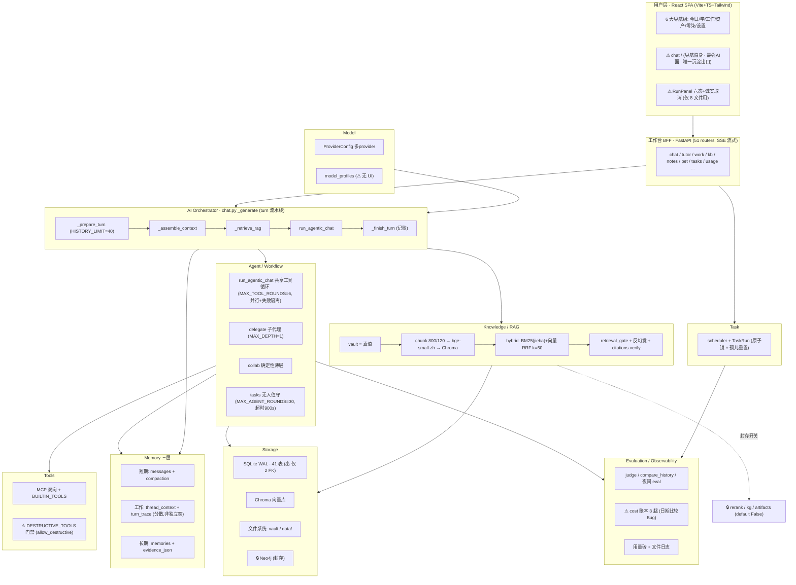

# 项目升级方案 · AI 个人工作台（D:\TP\A）

> 本文档由一轮**只读**的 CTO 级复审产出（2026-09-28）。本轮不改任何代码，仅落地"理解 → 问题 → 方案 → 优先级"。
> 定位：**在 2026-09-27《CTO 审查报告》之上增量**，不重新推导、不推翻其已定结论。凡与那份账本冲突处，以那份为准并在此显式标注。
> 所有 Bug 尽量锚定到 `file:line`；不确定的标「需进一步确认」；不凭空假设。

## 与既有账本的关系（先说清楚，避免重复劳动）

2026-09-27 的报告是"唯一持续有效的结论层"，已定的三条底盘**本轮继续沿用、不再论证**：

1. **架构形状不变** —— 单人本地优先、单进程单事件循环、SQLite(WAL)+Chroma。不引 Redis/MQ/微服务/容器。
2. **没有 V2** —— 单人工具靠"修剪"而非"扩张"演进；新增能力必须先证明使用面，而非功能面。
3. **30 天使用窗口裁决删留** —— 功能是否保留由真实使用数据决定，不由"看起来该有"决定。

那份报告的核心量化结论——**功能面 ≫ 使用面**——在本轮六路只读排查中被再次、独立地证实（下文各处引用）。因此本"升级方案"**不是加东西的方案，是让已建的东西对齐真实使用、并修掉真实缺陷的方案**。文末《最终升级路线》会显式回应用户模板里的 V1–V4 扩张设想为何不采纳。

---

## 一、项目总体评价（8 维）

| 维度 | 判断 | 依据（file:line 为主） |
|---|---|---|
| **产品** | 定位清晰（三线一体 学×工作×陪伴 + 零柒独立一线），但**功能面严重跑赢使用面**。26 项功能（README）在 10 天窗口里真正被用的只有个位数：briefing22/deliver12/pet5/compose2/candidate1/skill_eval1，tutor_sessions=0、cards=0、conversations=3、messages=4。 | `docs/CTO审查报告-2026-09-27.md`；`/api/usage/*` 双端点 |
| **架构** | 干净、克制、自洽。单进程单事件循环 + async SQLAlchemy + SQLite(WAL) + Chroma；51 个 router 全部注册、无孤儿、无 TODO 欠账。 | `main.py:193-244`；feeds.mail_router `:233` |
| **AI 能力** | 完整的一条链都在：turn 组装 → RAG(混合检索+反幻觉+引用核验) → 共享工具循环(并行/失败隔离) → 收尾记账。缺一个**统一的失败/超时/取消口径**。 | `chat.py:_generate 784-1289`；`llm.py:run_agentic_chat 276-437` |
| **Agent** | 三件套分层合理、非重复：`run_agentic_chat`(共享循环) / `delegate`(子代理 MAX_DEPTH=1) / `collab`(delegate 之上的确定性薄层，`collab.py:394`) / `tasks`(无人值守 MAX_AGENT_ROUNDS=30)。破坏性工具有门禁。 | `mcp.py:893,962-964`；`delegate._specs` |
| **RAG** | 工业级：vault=真值 → chunk(800/120) → bge-small-zh → Chroma；hybrid(BM25 jieba+向量 RRF k=60) + retrieval_gate + 反幻觉 `_build_rag_context` + `citations.verify`。 | `chat.py:_retrieve_rag 580-673` |
| **数据** | 派生纪律强（单一真值 + 两条**有意**的派生回写例外：卡片 SM-2、记忆 insight/merge）。但**全库仅 2 个外键**，其余靠软引用 → 孤儿行风险。 | `models.py:57-59, 793-795` |
| **工程质量** | 高。**无 P0/P1 后端 Bug**；类型纪律强（全仓仅 1 处 `any`@`EChart.tsx:1`）；有设计守卫测试、夜间 eval、用量砖、原子任务锁、孤儿运行重置。 | `designRules.test.ts`；`tasks.py:790-816`；`main.py:135` |
| **用户体验** | 组件级诚实（RunPanel 六态 + 真实取消语义 `:62-68`），但**系统级不一致**：进度四套并存、取消语义有真有假、沉淀出口只在 chat。 | `RunPanel`（仅 8 文件用）；`App.tsx:177-210` |

**一句话总评**：这不是一个"缺功能"的项目，是一个"建得比用得多、且各场景各行其是"的项目。工程底子扎实到几乎没有致命 Bug——真正的杠杆在**收敛**（让六个场景共用同一套沉淀/进度/取消语义）和**裁决**（按 30 天窗口删掉没人用的实验面），而非新增。

---

## 二、当前最大的 10 个问题（按真实影响排序，不打分）

> 排序依据：对"这个工具能不能被日常用起来 / 会不会悄悄出错"的真实影响，而非技术新鲜度。标 `[新]`=本轮发现，`[承]`=承接 2026-09-27 账本。

**1. `[承]` 功能面 ≫ 使用面（元问题）。** 26 项功能，10 天里真正跑起来的个位数，tutor/cards/conversations 近乎为零。这不是"再加个功能"能解决的——它说明**增量方向应是收敛与裁决，不是扩张**。后面 9 条都服务于这个判断。

**2. `[新]` 「沉淀 → 可复用产出物」的出口碎裂，只活在 chat 里。** SaveToVault / ArtifactReceipt / `artifacts.ts` 只挂在聊天面（`App.tsx:177-210`）。四个个人信息/知识场景（notes/kb/tutor/companion）产出了好东西，却**没有统一动作把它变成 vault 里可复用的资产**。这是全项目最伤"闭环"的一处产品裂缝——AI 答得好，却沉淀不下来。

**3. `[新]` AI 进度/取消语义四套并存，六态纪律只覆盖 work 模块。** `RunPanel` 的六态 + 诚实取消（`:62-68`）只有 8 个文件在用；tutor 核心教学只有一句"在想…"（`TutorPage ~3000-3002`），kb 分钟级操作无进度无取消。更糟的是**部分 one-shot POST 的"停止"是假的**——前端断开、后端仍在跑仍在计费。对一个成本敏感的单人工具，这是实打实的钱在漏。

**4. `[新·已实证]` `cost.py` 日期比较用字典序，预算护栏系统性少算。** `_since`(`cost.py:27-28`) 与 `_monthly_usage`(`cost.py:238-241`) 都用 `datetime.now(...).astimezone().isoformat(...)`，产出 `2026-09-01T00:00:00+08:00`（`T` 分隔 + 本地时区偏移）；但 SQLite 里 `created_at` 存的是**空格分隔的 naive UTC**（`2026-09-01 00:00:00`，由 `skill_metrics.py:111` 的正确写法反证）。`WHERE created_at >= :since` 是**文本字典序**比较：`' '(0x20) < 'T'(0x54)`，导致**边界日的行被整片丢掉**，叠加 8 小时时区偏移 → 月度预算**系统性少报**。BUG-007（4092765）补上了 model_usage 那条腿，但**没碰这个日期格式 Bug**——护栏坐在一个仍然漏水的地基上。

**5. `[新]` 最强的 AI 面 chat（`/`）在导航里隐身。** chat 是唯一能自由用工具 + 唯一有沉淀出口的面，却不在六大导航组里。使用数据（conversations=3）与"入口藏起来"高度相关——把最强的面藏起来，然后统计它没人用。

**6. `[承]` 五/六个 god-file 未分片。** `api.ts` 3760 行、`SettingsPage` 3657 行（73 个 useState）、`TutorPage` 3156 行（~79 useState）、`DashboardPage` 2225、`App` 2080（含 ChatView ~1600）、`KBPage` 1709、`PetWidget` 1546。`designRules.test.ts:359-370` 有一张"10 个 >1000 行文件"的账本测试盯着。分片模式已在 work 模块验证过（≤1000 行守卫 `:276-299`），只是没推广。

**7. `[新]` 数据模型全库仅 2 个外键 → 孤儿行风险。** 只有 `Message→conversations`(CASCADE, `models.py:57-59`) 和 `TutorTurn→tutor_sessions`(`:793-795`) 有 FK。task_runs / model_usage / thread_items 等全靠软引用，删父行不清子行——长期跑下来账本里会攒孤儿。

**8. `[新]` MCP server 命名撞保留前缀 → 工具静默不可达。** `mcp.py:1090-1128`（判断在 `:1092`）：若某个 MCP server 被命名为 `vault`/`memory`/`skill` 等内建前缀，其工具会**静默地无法被路由到**，不报错。边缘场景，但"静默"是它危险的地方。

**9. `[新]` 辅助 LLM 调用未记账 + 只读派生面是用量盲区 → 裁决数据不完整。** compaction(`compaction.py:69`)、followups(`chat.py:770,1304`) 烧的 token 没进账本；`/api/usage/features` 只覆盖 ~25 个 LLM 操作，对 chat/tasks/只读面盲。**这直接动摇了第 1 条赖以裁决的数据可信度**——你在用一把有刻度盲区的尺子做删留决定。

**10. `[承]` 封存开关/实验面悬而未决，维护面在累积。** collab / kg_enabled / rerank_enabled / roundtable / 学模块 / artifacts 等默认关或低用，等 30 天窗口裁决。悬着不决本身是成本：每个都得在重构时被绕开、被测试覆盖、被读代码的人重新理解。

> **P3 尾巴（不进 Top10，但一并清）**：`_structured_round` 死代码(`chat.py:1345-1372`)、migrations `_m021` 重复(`:532` 与 `:691`)、save_cards id 重取竞态(`cards.py:722-732`)、pet_state 同步 sqlite3 可能阻塞事件循环(`pet_state.py:657/689/739/773`)、`shutil.rmtree` 无 Windows 回退(`skills.py:231`)、git clone 缺 `--`(`repos.py:104`)、CI typecheck 无可复现 npm script(`ci.yml:45`)、48 处静默 catch（`designRules.test.ts` 注释仍写"46/16"已过期）、comparison-mode `partial_parts` 空操作 del(`chat.py:851,949,1134-1136`)、turn_trace `_write` 静默丢未知键(`turn_trace.py:122-152`)。

---

## 三、最值得升级的 10 个方向

> 模板：**现状 → 问题 → 方案 → 复用什么 → 风险 → 优先级**。全部是"收敛/修复/裁决"型，**没有一条是加新能力**——这是刻意的，见文末对 V4 扩张设想的回应。

### 方向 1 · 统一「沉淀 → 产出物」出口 `[新]`
- **现状**：SaveToVault / `save_artifact` / `artifacts.ts` 只挂在 chat（`App.tsx:177-210`）。
- **问题**：notes/kb/tutor/companion 产出无法一键变成 vault 可复用资产 → 闭环断在最后一步。
- **方案**：把"选中内容/AI 回答 → 存为 vault 产出物"抽成一个共用动作（前端一个 hook + 复用现有 `save_artifact` 工具），挂到四个场景的产出位。
- **复用**：`artifacts.ts`、`save_artifact` 工具、ArtifactReceipt 组件——**全是现成的，只是泛化挂载点**。
- **风险**：低。纯前端接线 + 复用后端工具，不动数据模型。
- **优先级**：**最高**（这是全项目最伤闭环、且投入产出比最高的一处）。

### 方向 2 · 把 RunPanel 六态 + 诚实取消推广出 work 模块 `[新]`
- **现状**：六态进度 + 真实取消只覆盖 8 个文件；tutor 核心教学一句"在想…"，kb 无进度无取消。
- **问题**：进度四套并存、取消有真有假（POST 断开≠后端停止），成本敏感工具在漏钱漏信任。
- **方案**：以 `RunPanel`(`:62-68`) 为唯一进度/取消组件，推广到 tutor 核心教学与 kb 分钟级操作；对 one-shot POST 补真正的中断信号（`AbortController` → 后端 cancel token）。
- **复用**：`RunPanel` 组件与其六态；work 模块已跑通的取消链路。
- **风险**：中。真实取消要后端配合中断长任务，需按面逐个接、逐个回归。
- **优先级**：高。

### 方向 3 · 修 `cost.py` 日期比较（含 BUG-007 遗留）`[新·已实证]`
- **现状**：`_since`/`_monthly_usage` 用 `.astimezone().isoformat()`，与 SQLite 存储格式不匹配。
- **问题**：字典序比较丢边界日 + 时区偏移 → 预算护栏系统性少报（详见问题 4，已在 `cost.py:27-28,238-241` 核实）。
- **方案**：统一改为 `skill_metrics.py:111` 的正确写法——naive UTC + `.isoformat(sep=" ", timespec="seconds")`，与存储格式对齐。
- **复用**：`skill_metrics.py` 已有正确范式，直接对齐即可（最好抽一个共用 `_since` 工具函数，杜绝再次分叉）。
- **风险**：低，但**必须补边界日回归测试**（现有 test_cost.py 在每月非 1 号跑会侥幸通过，掩盖了 Bug）。
- **优先级**：高（正确性问题，且是护栏的地基）。

### 方向 4 · 补全用量裁决口径（让 30 天窗口的尺子可信）`[新]`
- **现状**：compaction/followups 未记账；`/api/usage/features` 对 chat/tasks/只读面盲。
- **问题**：裁决删留靠的正是这把尺子，尺子有盲区 → 删留决定不可信（直接影响方向 5）。
- **方案**：给辅助 LLM 调用补 `_absorb_usage` 记账；只读面用 `/open-days`+`/visit` 双读补上"页面被打开但没跑模型"的使用信号。
- **复用**：`_absorb_usage`(`llm.py:73-97`)、已有的 open-days/visit 端点。
- **风险**：低。加记账点不改现有账本口径（三条腿互不重复的纪律要守住）。
- **优先级**：高（**必须先于方向 5 落地**，否则是拿坏数据做删除决定）。

### 方向 5 · 实验面处置：~~按 30 天窗口裁决删留~~ → **全部保留，转入优化升级** `[已改向]`
- **用户决策（2026-09-28）**：不做按使用时间的删留判断，**不删除任何现有功能**——六个实验面（collab / kg / rerank / roundtable / 学模块 / artifacts）全部保留，转入优化升级路线。
- **核实（2026-09-28）**：六面的 UI 入口已全部齐备——collab=CollabPins+chat、rerank=设置页开关、kg=知识库「图谱」标签（配置/构建/清空齐全）、roundtable=学页圆桌、学模块=方向 1 沉淀 + 方向 2 真进度、artifacts=方向 1 泛化后的产出回执。「建了碰不到」的问题已不存在。
- **后续优化方向**：kg / rerank 启用前先跑对照评测拿数字（kg：「图谱上下文 vs 纯向量检索」；rerank：`backend/evals/retrieval/` 金标）；其余面按使用中暴露的具体问题逐个小步优化。

### 方向 6 · 前端 god-file 分片 `[承]`
- **现状**：api.ts 3760 / SettingsPage 3657(73 useState) / TutorPage 3156 / 等 6 个巨石；`designRules.test.ts:359-370` 有账本盯着。
- **问题**：可维护性；73/79 个 useState 的单文件是改一处牵全身的雷区。
- **方案**：照 work 模块已验证的模式（≤1000 行守卫 `:276-299`）分片——SettingsPage 按 section 拆、TutorPage 按 tab 拆、api.ts 按域拆再 re-export（保持导入路径不变）。
- **复用**：work 模块的分片模式与守卫测试。
- **风险**：中。纯结构重构无行为变更，但面大、useState 多，须小步 + 每步跑设计守卫与类型检查。
- **优先级**：中（V1.2 已排期项，确认执行）。

### 方向 7 · chat 入口在导航里显形 `[新]`
- **现状**：chat（`/`）不在六大导航组。
- **问题**：最强 AI 面 + 唯一沉淀出口被藏起来，与低使用高度相关。
- **方案**：给 chat 一个明确的导航入口（或在"今日"里给常驻入口）。配合方向 1 后，chat 的沉淀能力也会扩散到其他面，入口显形的收益更大。
- **复用**：现有路由，纯导航配置。
- **风险**：极低。
- **优先级**：中（小改动、高杠杆）。

### 方向 8 · 数据模型补外键 / 应用层清理孤儿 `[新]`
- **现状**：全库仅 2 个 FK；task_runs/model_usage/thread_items 等靠软引用。
- **问题**：删父行不清子行，长期攒孤儿。
- **方案**：优先给高频父子关系补 `ondelete` FK；SQLite 加 FK 需谨慎（需 `PRAGMA foreign_keys=ON` 且历史数据可能已有孤儿），迁移前先跑一次孤儿盘点。无法加 FK 处退而用应用层级联清理。
- **复用**：现有 migrations 框架、WAL+PRAGMA 已就绪。
- **风险**：中。动数据模型须先盘点存量孤儿、逐表评估，**不可一把梭**。
- **优先级**：中。

### 方向 9 · P3 卫生批量清理 `[新]`
- **现状**：死代码 `_structured_round`、`_m021` 重复迁移、CI typecheck 无 npm script、过期注释计数（"46/16"实为 48/18）、turn_trace 静默丢键等。
- **问题**：单个都不致命，累积起来是"读代码的人被误导"的税。
- **方案**：一次性清理批次——删死代码、删 `_m021` 重复定义（已核实等价、非 Bug，删 `migrations.py:691-710`）、补 `typecheck` npm script 让 CI 可复现、更新过期注释。
- **复用**：无，纯清理。
- **风险**：低（去重迁移那条要单独验证等价性，标"需进一步确认"）。
- **优先级**：低。

### 方向 10 · `profiles.py`：补 UI 或裁端点 `[新]`
- **现状**：`/api/model-profiles`（4 端点）是唯一**有能力、后端在用（`model_profiles.effective()`@`chat.py:499`）、却无前端 UI** 的 router。
- **问题**："能力存在但用户碰不到"——要么补 UI，要么确认它只作内部默认、把对外端点收掉。
- **方案**：二选一，交用户拍板（见确认清单）。core 逻辑无论如何保留（chat 依赖它）。
- **复用**：现有端点与 effective() 逻辑。
- **风险**：低。
- **优先级**：低。

---

## 四、推荐产品架构

> **重要**：下图画的就是**当前的真实形状**，不是另起炉灶的蓝图。既定 doctrine 是"架构形状不变"，本轮完全认同——这套单进程本地优先的形状对单人工具是**正确**的选择。图中标 ⚠ 的是本方案要动的接缝，标 🔒 的是封存/待裁决面。

---

## 五、分阶段分析

### 5.1 架构分析
- **形状**：单进程、单事件循环、async SQLAlchemy + SQLite(WAL, aiosqlite) + Chroma。对单人本地工具是恰当选择——无分布式复杂度、无运维面、崩溃恢复靠 WAL + 孤儿重置。
- **健康度**：51 router 全注册无孤儿（`main.py:193-244`）、无 TODO 欠账、启动做 `reset_orphan_runs`(`main.py:135`)、任务有原子锁(`tasks.py:790-816`)。
- **唯一系统性弱点**：数据模型只有 2 个 FK（软引用为主）→ 孤儿风险（方向 8）。这是"形状正确、约束不足"，不是架构错误。

### 5.2 功能分类（按"是否真被用"而非"是否存在"）
- **在用主力**：briefing（今日）、deliver/compose（成文引擎家族）、pet（零柒）。
- **成文引擎家族**：deliver/compose/research/decide/conflict/recap 共享 `report.py` + 同一套 prompt（`engine_eval.py:6,44`；`quality.py:32`）——**是一条产品线，不能单删某一个**。真正的重叠是 research-vs-compose（同脊柱、不同取数），非重复实现。
- **有能力无 UI**：`profiles.py`（方向 10）。
- **待裁决实验面**：collab / kg / rerank / roundtable / 学模块 / artifacts（方向 5）。
- **智能体三件套非重复**：delegate/collab/tasks-agent 是分层复用，roundtable/podcast/pet 复用**同一条 podcast 管线**——不是三份实现。

### 5.3 四场景 × 六阶段矩阵（学A / 工作B / 信息C / 陪伴D）

| 阶段 | A 学习(tutor) | B 工作(work) | C 信息(kb/notes) | D 陪伴(pet) |
|---|---|---|---|---|
| ① 入口 | 导航有 | 导航有 | 导航有 | 导航有(零柒独立线) |
| ② 输入 | 强 | 强（4 域真跑 AI/成本） | 中（sink 语义被拆散） | 弱（chat 变不成产出物） |
| ③ AI 执行 | **核心教学仅"在想…"** | **RunPanel 六态齐** | 分钟级操作无进度 | 复用 podcast 管线 |
| ④ 进度/取消 | 缺 | **真实取消** | 缺 | 部分假停止 |
| ⑤ 沉淀 | ✗ 无统一出口 | 部分 | **SaveToVault 只在 chat** | ✗ 长期记忆前端不可见 |
| ⑥ 复盘 | tutor progress 不一致 | recap 引擎 | — | 事件驱动、镜子非掌柜 |

**读表结论**：B(work) 是六阶段最完整的场景——**它已经在四个域真跑 AI 和成本**（`ReportPage.tsx:211-295`、`WorkPage.tsx:330-365`、`ThreadsPage.tsx:329`）。这一条**直接推翻了旧记忆里"/work 现在只读"的说法**（见文末记忆更新项）。其余三场景的短板集中在 ③④⑤——**正是方向 1（沉淀出口）和方向 2（进度/取消）要补的两块**。把 B 已跑通的范式复制给 A/C/D，比任何新功能都值。

### 5.4 AI 架构 / AI 工作流
- **一条主链**（`chat.py:_generate 784-1289`）：`_prepare_turn`(368-449, HISTORY_LIMIT=40) → `_assemble_context`(452-577) → `_retrieve_rag`(580-673) → `run_agentic_chat`(llm.py:276-437) → `_finish_turn`(676-781)。所有阶段齐备。
- **共享工具循环**（`llm.py`）：MAX_TOOL_ROUNDS=6(`:25`)、并行 gather(`:427-430`)、失败隔离(`:394-398`)、结果截断 8000(`:409-410`)。BUG-008 双重防线：广告层 `_advertised`(`:326-327`) + 执行层 `_run_one` 复核(`:387-391`)——**授权不只在广告层生效，执行层也拦未广告的破坏性调用**（test_destructive_gate.py 有正反用例钉住）。
- **破坏性门禁**：`DESTRUCTIVE_TOOLS`(`mcp.py:893`) 由 `allow_destructive` 过滤(`:962-964`)；交互面按"这一轮说的话"授权（`chat.py:829` asked_to_forget），**无人值守两条路（定时任务/子代理）永远拿默认值**——没有"这一轮"可问，就不给那只手。
- **唯一缺口**：chat 主链**没有整轮超时**（任务侧有 `asyncio.wait_for(timeout=900)` `tasks.py:60,477-479`，chat 侧没有）。配合方向 2 的取消，应补一个整轮护栏。

### 5.5 Bug 清单（P0–P3）

**P0 / P1：无。** 六路排查一致确认——后端代码质量很高，无致命/严重 Bug。

**P2-1 · `cost.py` 日期字典序比较（已实证）**
- 文件/位置：`cost.py:27-28`(`_since`)、`cost.py:238-241`(`_monthly_usage`)。
- 原因：`.astimezone().isoformat()` 产 `T` 分隔 + `+08:00`；SQLite 存空格分隔 naive UTC（`skill_metrics.py:111` 反证正确格式）。文本比较 `' '<'T'` + 时区偏移。
- 触发：任何跨边界日/小窗口的用量与预算聚合；每月 1 号跑测试最易暴露。
- 影响：月度预算护栏**系统性少报** → 明明超预算也判"没超"。BUG-007 未触及此。
- 严重度：P2（正确性，非崩溃；但护栏是花钱的最后防线）。
- 方案：对齐 `skill_metrics.py:111` 写法 + 抽共用 `_since` + 补边界日回归测试。
- 是否立即改：**是**（Round-2 首批）。

**P2-2 · MCP server 名撞内建前缀 → 工具静默不可达**
- 位置：`mcp.py:1090-1128`（判断 `:1092`）。原因：server 名前缀与 `vault/memory/skill` 冲突时路由静默失败。触发：新增同名 MCP server。影响：工具悄悄消失、不报错。严重度：P2（静默）。方案：命名冲突时显式报错/加前缀隔离。是否立即改：Round-2 中批。

**P2-3 · backup 同盘（T8）**：`backup.py:24` 备份落同一物理盘 → 盘坏两失。**用户决策项**（异地/外盘策略），非纯代码修复。

**P3 批（逐条，Round-2 低优批次一起清）**
| # | 问题 | 位置 | 影响 | 方案 |
|---|---|---|---|---|
| P3-1 | `_structured_round` 死代码 | `chat.py:1345-1372` | 误导读者 | 删 |
| P3-2 | `_m021` 重复定义（已核实**等价**、非 Bug） | `migrations.py:691-710`（列表在 `:683` 绑定的是 532 那个） | 无行为差异，仅冗余定义 | 删第二个定义 |
| P3-3 | save_cards id 重取竞态 | `cards.py:722-732` | 并发下取错 id | 单查询回填 |
| P3-4 | pet_state 同步 sqlite3 阻塞事件循环 | `pet_state.py:657/689/739/773` | 事件循环卡顿 | 改 async 或 to_thread |
| P3-5 | `shutil.rmtree` 无 Windows 回退 | `skills.py:231` | Win 只读文件删除失败 | 加 onerror 回退 |
| P3-6 | git clone 缺 `--` | `repos.py:104` | 特殊分支名注入风险 | 补 `--` 分隔 |
| P3-7 | CI typecheck 无 npm script | `ci.yml:45` | 本地不可复现 | 补 `typecheck` script |
| P3-8 | comparison-mode `partial_parts` 空 del | `chat.py:851,949,1134-1136` | 仅错误兜底路径无副作用 | 清理 |
| P3-9 | turn_trace `_write` 静默丢未知键 | `turn_trace.py:122-152` | 调试信息丢失 | 记警告或白名单校验 |
| P3-10 | 静默 catch 计数注释过期 | `designRules.test.ts`("46/16"→实 48/18) | 文档漂移 | 更新注释 |

> 已排除的**假阳性**（不改）：secrets.py 用 DPAPI（正确）、路径穿越有守卫、subprocess 用 list 形式（无注入）。run-lock dict 无清理为 P3/nit，**需进一步确认**是否有实际泄漏。

### 5.6 数据与记忆系统
- **记忆三层**：短期(messages+compaction)、工作(thread_context+turn_trace，**分散实现、非独立表**)、长期(memories+evidence_json)。prefs 默认：memory_enabled True(`:36`)、thread_context True(`:39`)、automemory **False**(`:40`)、memory_tidy **False**(`:41`)。
- **单一真值**：全局成立，仅两处**有意**派生回写例外——卡片 SM-2 复习态、记忆 insight/merge。这是"例外清单"式的受控破例，非架构漏洞。
- **成本账本三条腿**：messages / task_runs / model_usage，经 `_absorb_usage`(`llm.py:73-97`) 互不重复。记账缺口见问题 9（compaction/followups 未记）。
- **孤儿风险**：见方向 8。

### 5.7 核心闭环
理想闭环：**输入 → AI 执行(可见/可停) → 沉淀为可复用产出物 → 复盘再用**。当前**只有 chat + work 两条路走全**；A/C/D 断在 ③(进度) 与 ⑤(沉淀)。**方向 1+2 就是把这条闭环在四个场景补齐**——这比任何新功能都更贴近"让工作台真正被用起来"。

---

## 六、最终升级路线（4 阶段）

> 用户模板给的是 V1–V4 逐级扩张（V4 = 多 agent 平台 / 个人知识图谱 / 主动式 AI…）。**本方案不采纳那种扩张框架**，理由在阶段四后说明。这里把四阶段重新定义为**修 → 收敛 → 裁决 → 稳态**，与既定"没有 V2、只修剪"的 doctrine 一致。

### 第一阶段 · 修（正确性，1–2 周内可完成）
- ✅ 方向 3：修 `cost.py` 日期比较 + 补边界日回归测试。（2026-09-28 · 224dda3，另抽了 `timeutil` 统一口径）
- ✅ P3 批清理（P3-1~P3-10），其中 P3-2 去重迁移须先验证等价。（2026-09-28 · be2170f，等价已自核）
- ✅ 补 chat 主链整轮超时护栏（对齐任务侧 900s 语义）。（2026-09-28 · 21d91ab）
- **产出**：护栏地基正确、死代码清零、账本口径可信的前置。

### 第二阶段 · 收敛（一致性，最高杠杆）
- ✅ 方向 1：统一"沉淀 → 产出物"出口，泛化到 notes/kb/tutor/companion。（2026-09-28 · d31aad5；kb 场景落在划词助手——KBPage 本身没有可留存的 AI 回答）
- ✅ 方向 2：RunPanel 六态 + 诚实取消推广出 work 模块；补 one-shot POST 真实中断。（2026-09-28 · 0ec0c6a + 后续提交；tutor 教学面真停、kb reindex/eval 用既有 `inflight` 合作式取消——同款机制 prompt/skill 评测 09-26 已建，其余 one-shot 面可按需复用）
- ✅ 方向 7：chat 入口导航显形。（2026-09-28 · dbe0987，导航账本测试同步更新）
- ✅ 方向 4：补全用量记账（compaction/followups + 只读面双读）。（2026-09-28 · 6181a22）
- **产出**：四场景闭环补齐、进度/取消/沉淀语义统一、裁决尺子可信。**这一阶段是整个方案的重心。**

### 第三阶段 · 裁决（做减法，不是加法）
- ~~方向 5：用可信的 30 天窗口逐个裁决~~ **已改向（2026-09-28 用户决策）：六个实验面全部保留、转入优化升级，见上方方向 5 的新写法。**
- 🔶 方向 6：god-file 分片（照 work 模块守卫模式）。（进行中：api.ts 两刀已落地——方法拆到 `src/api/` 26 个文件、类型拆到 `src/api/types/<域>.ts`，api.ts 只剩转发 + 组合 163 行，全仓导入路径不变；KBPage 1766→96 行，五个页签各自成组件；PetWidget 1546→806 行，纯逻辑进 petNudges/petDrag/petPip/petShared，指针/测量状态机进 usePetDrag/usePetDodge，展示层进 PetPanel/PetPluginRow；DashboardPage 2249→774 行，指标卡/评估卡拆成 dashboardCards + dashboardEvalCards，决策日志节拆成自含状态的 DashboardDecisions，测试引用的卡名经原路径 re-export；TutorPage 第一刀 3205→2320 行，页面小件拆到 tutorShared、三张成文卡+材料消化卡拆到 TutorReportCards（状态留在本体，以单一 props 对象传入），台账仍记 TutorPage。designRules 超 1000 行台账 10→6 笔。剩 TutorPage 第二刀（开场屏/概念轨/概览）与 SettingsPage，小步推进）
- ✅ 方向 8：孤儿盘点 + 补 FK/应用层清理。（2026-09-28 · 3eda749：`orphan_audit.py` 只读盘点 7 对关系，生产库实测**零孤儿**；`threads.delete` 对 task_runs/model_usage 的归因**摘钩不删账**——按 7.1-4 的推荐走了应用层级联，未加 FK）
- ✅ 方向 10：profiles.py 补 UI 或收端点（按 7.1-3 推荐收端点）。（2026-09-28 · 3eda749：4 端点无前端/无 MCP 消费，CLI `model_check.py` 已覆盖读写；core `effective()` 照旧供 chat，核内零改动）
- **产出**：维护面收缩、代码库与真实使用对齐。

### 第四阶段 · 稳态（形成什么能力）
**不是**"AI 原生多 agent 平台"。是：**一个用量与真实使用对齐、六场景闭环一致、维护面可持续的单人 AI 工作台**。到这一步，"升级"的定义就从"加功能"永久切换为"随使用数据持续修剪与打磨"。

#### 为什么不采纳模板的 V4 扩张设想（直说）
1. **数据不支持**：功能面已远超使用面，再加多 agent/知识图谱/主动 AI，是往一个没被用满的系统上继续堆。
2. **doctrine 冲突**：既定结论是"没有 V2、架构形状不变、只修剪"。多 agent 平台化会引入调度/状态/并发复杂度，正是单进程本地形状刻意回避的。
3. **kg 已有前车**：Neo4j/kg_enabled 早已存在且**封存默认关**——知识图谱不是没能力，是没被证明值得开。先裁决它，再谈"个人知识图谱"才诚实。
4. **主动式 AI 与"镜子非掌柜"冲突**：零柒的既定设计是事件驱动、不制造负债感。主动推送式 AI 与这条产品哲学直接抵触。

> 若未来 30 天数据**真的**显示某个扩张方向被反复需要，届时再单独立项、用同样的"先证明使用面"标准评估——而不是现在预支。

---

## 七、附录

### 7.1 我的推荐（逐项，结论先行；红线项仍等你点头才动）

> 用户 2026-09-28 追加："你看看你推荐什么然后更新进那个方案"。以下是我的真实判断，不是选项罗列。其中 2、6 我已读代码定论，不再挂"待确认"。

1. ~~**第三阶段删除——不搞一刀切，分三层。**~~ **已被 2026-09-28 用户决策取代**：不做删留裁决、不删功能，六个面全部保留并转入优化升级（见方向 5 的新写法）。以下原推荐仅存档：
   - ~~kg / rerank / artifacts~~：原推荐「删（待数据确认）」→ **保留**；kg/rerank 启用前先跑对照评测。
   - ~~collab / roundtable~~：原推荐「留」→ **保留**（不变）。
   - ~~学模块（tutor/cards）~~：原推荐「不删、先修」→ **保留**，且方向 1（沉淀）与方向 2（真进度）已落地。
2. **`_m021` 去重——已定论：两处 DDL 完全等价（仅 docstring 一词之差）、`_add_column` 幂等、MIGRATIONS 仅注册一次（`migrations.py:683`→绑定 532 那个）。不是 Bug，是无害重复。** **推荐：删第二个定义 `migrations.py:691-710`**，降为纯 P3 清理。
3. ~~**profiles.py——推荐：收对外 4 端点，保留内部 `effective()`。**~~ **已按此推荐执行（2026-09-28 · 3eda749）**：端点收掉（前端/历史零消费），CLI `app/model_check.py` 覆盖读写；单人工具不再养一个没有 UI 的面。
4. ~~**补 FK 范围——推荐：应用层级联清理优先，FK 二期。**~~ **已按此推荐执行（2026-09-28 · 3eda749）**：`orphan_audit.py` 只读盘点（实测零孤儿）；`threads.delete` 对账本归因摘钩（置 NULL 不删行）；FK 二期按需再议。
5. **T8 备份——推荐：外接物理盘 + 定时 copy，不上云。** 云备份引入凭证/网络/隐私面，与本地优先 doctrine 相悖。最低成本：一块外盘 + 现有 backup 定时任务改落点。
6. **run-lock dict——已定论：`_RUN_LOCKS`（`core/tasks.py:780`）按 task_id 键、无清理，但键空间有界、每锁极小，且加清理会引入锁竞态。** **推荐：不修（WONTFIX），加一行注释说明有界即可。**

### 7.2 本轮不动的强项（"别碰"清单）
- **类型纪律**：全仓仅 1 处 `any`(`EChart.tsx:1`)——不要在重构中破坏。
- **设计守卫测试**（`designRules.test.ts` 12 条）与**路由单一真值**——保留。
- **破坏性工具双层门禁**（广告层 + 执行层 BUG-008）——不要简化。
- **RAG 反幻觉 + 引用核验链**——不要为"提速"抄近路。
- **单一真值派生纪律 + 成本三腿口径**——新增记账点不得破坏三腿互不重复。
- **架构形状**（单进程/本地优先/无中间件）——不引 Redis/MQ/容器。

### 7.3 记忆更新（2026-09-28 已执行）
已更新记忆 `feedback_work-module-ai-does-work.md`。**更正要点（我自核后比初判更精确）**：
- **页面层**：工作模块产出面确已真跑引擎——报告页 `streamDeliver` 流式生成（`ReportPage.tsx:228`）、派发面 `runTask`（`DispatchPanel.tsx:170`）、事项页交付回 thread。"别做成只读展示"的诉求在此层**已落地**。
- **但 `/api/work` 路由本身仍是只读聚合视图**（`routers/work.py:8` 仍写「只读、不落库、不写盘」）——真正的 AI 处理走 deliver/report/tasks 等**兄弟引擎**，不是 `work.py` 自己。
- 故"/work 只读"对**路由**仍成立、对**工作模块作为用户面**才过期。此前我笼统说"已被推翻"不准确，记忆与本文档均已更正。核心反馈（work = 处理工作的工作流，非卡片/展示）保留不变。

---

### 落地说明
- 本文档为 **Round-1 只读产物**，未改任何代码。
- Round-2 按模块小步执行、每步回归；删除类与红线项逐项确认。
- 一切以 2026-09-27《CTO 审查报告》为底盘账本，本文档是其增量层。
- **执行进度（2026-09-28）**：第一、二阶段的 7 项全部落地（10 个 commit，每项带测试与聚焦回归；第二阶段收尾跑过一次全量 118 文件全过）。**方向 5 已由用户决策改向**：不做删留裁决、不删功能，六实验面全部保留、转入优化升级（kg/rerank 启用前先跑对照评测）。第三阶段：**方向 8、10 已落地**；方向 6（god-file 分片）进行中——api.ts 两刀拆完（3778→163 行），KBPage 按页签拆完（1766→96 行），PetWidget 拆完（1546→806 行，逻辑/状态机/展示分层），DashboardPage 拆完（2249→774 行，指标卡/评估卡/决策日志节各自成文件），剩 TutorPage/SettingsPage，按 work 模块守卫模式小步走。

